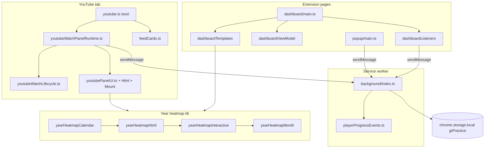
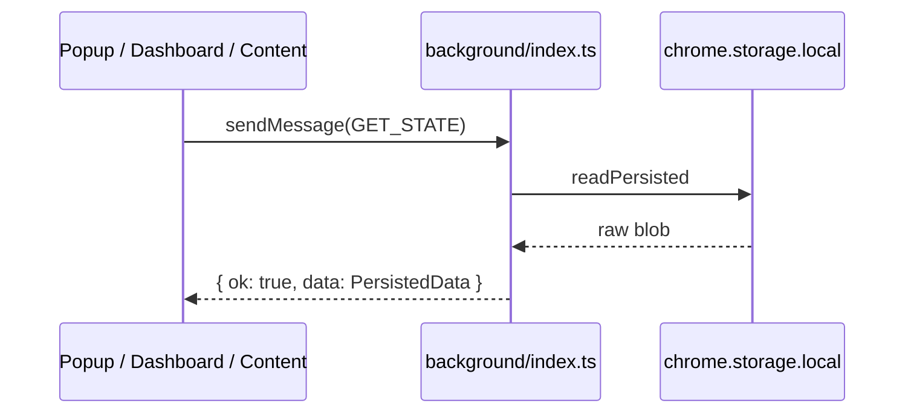
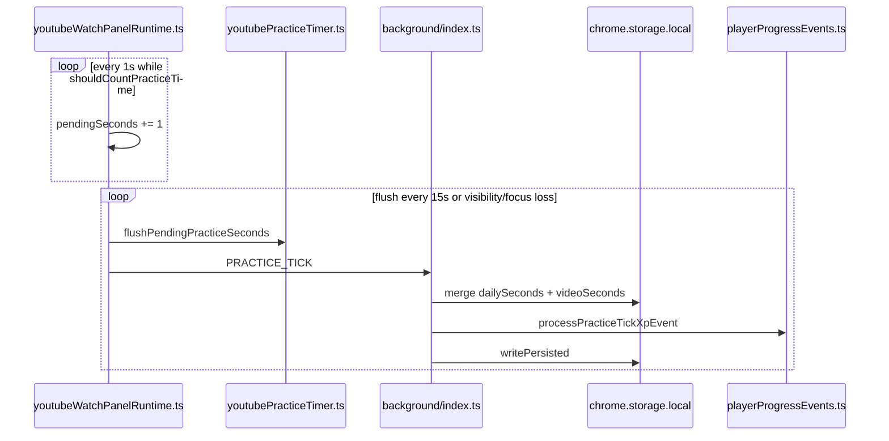
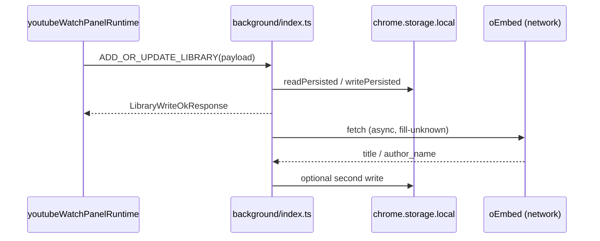

# ExplaneMe — project map for humans and AI

This document describes **JustPractice**, a Chrome MV3 extension: what each source file is for, how pieces connect, and rough **importance** / **complexity** scores. It also flags where **splitting into smaller files** would help maintenance.

> **Spelling:** the filename is `ExplaneMe.md` on purpose (per project request). If you prefer standard spelling, you could rename to `ExplainMe.md` and update references.

---

## How the extension fits together

- **Single source of truth:** `chrome.storage.local` under the key `jpPractice` (`STORAGE_KEY` in `src/lib/storage.ts`). Shape = `PersistedData` (library, daily/video practice seconds, settings, `playerProgress`, schema version).
- **Who writes storage:** almost always the **background service worker** (`src/background/index.ts`) after validating messages. Content scripts and pages send `chrome.runtime.sendMessage` payloads typed in `src/lib/messages.ts`.
- **Who reads storage for UI:** popup and dashboard call `GET_STATE` via messaging; the YouTube **content script** uses `GET_STATE` (library refresh, calendar snapshot) and listens to `chrome.storage.onChanged` for `STORAGE_KEY` to refresh UI without spamming the background. Open extension pages and the watch panel also **poll storage every ~15s while visible** (`src/lib/storageSyncPoll.ts`) as a safety net alongside `onChanged`.
- **YouTube entry:** `src/content/youtube.ts` (~34 lines) is **boot-only** — debug log, `attachWatchPanelRuntimeHooks()`, visibility debounce for calendar refresh, `storage.onChanged` → `onJpPracticeStorageChanged`, initial `onWatchPanelVideoChanged`.
- **YouTube orchestrator:** `src/content/youtubeWatchPanelRuntime.ts` (~627 lines) owns watch-panel state, practice intervals, library save/complete, calendar/XP wiring; delegates completion prompt to `youtubeWatchPanelCompletion.ts`, video/SPA binding to `youtubeWatchPanelVideoFlow.ts`, paint to `youtubePanelUi.ts` / `youtubePanelCalendarUi.ts`, mount to `youtubePanelMount.ts`, lifecycle glue to `youtubeWatchLifecycle.ts`.

**Architecture (mermaid)**

---

## Ranking legend

**Importance (1–5)** — how risky or central the file is if you edit it wrong.

| Score | Meaning |
|-------|---------|
| 5 | Core contract: storage schema, message protocol, or background persistence |
| 4 | Primary user-facing behavior (watch panel, dashboard, major content UX) |
| 3 | Shared domain logic many files import |
| 2 | Focused helpers, templates, or secondary UI |
| 1 | Config, env types, or copy-only JSON |

**Complexity (1–5)** — how hard the file is to reason about (DOM quirks, state, migrations, not line count alone).

| Score | Meaning |
|-------|---------|
| 5 | Many interacting concerns or YouTube-specific fragility |
| 4 | Large stateful UI or non-trivial algorithms |
| 3 | Moderate logic; clear boundaries |
| 2 | Small module with a few exports |
| 1 | Almost trivial |

**Split?** — whether splitting would likely improve clarity **without** being mandatory.

---

## Root and tooling (not under `src/`)

| File | Purpose | Connects to | Imp. | Cplx. | Split? |
|------|---------|-------------|------|-------|--------|
| `manifest.config.ts` | MV3 manifest: permissions, background entry, content script matches, popup/options HTML. Consumed by Vite CRX plugin. | All entrypoints listed inside it | 5 | 2 | No |
| `vite.config.ts` | Build: `@crxjs/vite-plugin`, stable `assets/[name].js` output names (avoids broken chunk URLs on YouTube). | `manifest.config.ts`, entire `src/` graph | 5 | 2 | No |
| `vitest.config.ts` | Runs `src/**/*.test.ts` (default env **node**; individual tests can set `jsdom`). | Test files | 2 | 1 | No |
| `tsconfig.json` | Strict TS; `chrome` types; **excludes** `**/*.test.ts` from typecheck (tests still run under Vitest). | All TS | 3 | 1 | No |
| `eslint.config.js` | Lint rules for the repo. | All TS/JS | 2 | 1 | No |
| `package.json` | Scripts: `dev`, `build` (tsc + vite), `test`, `lint`. | Tooling | 2 | 1 | No |
| `README.md` | Human-oriented product + dev instructions. | — | 1 | 1 | No |

**Manifest permissions** (`manifest.config.ts`): `storage`, `contextMenus`, `alarms`, `notifications`; host `https://www.youtube.com/*`, `https://m.youtube.com/*`. Entry: SW `src/background/index.ts`, content `src/content/youtube.ts`, popup `src/popup/index.html`, options `src/dashboard/index.html`.

---

## `src/lib/`

| File | Lines (approx.) | Purpose | Connects to | Imp. | Cplx. | Split? |
|------|-----------------|---------|-------------|------|-------|--------|
| `storage.ts` | ~25 | Re-exports `storageTypes` + `storageMigrate`; **`readPersisted`** / **`writePersisted`** only. | All importers of `./storage` | 5 | 2 | No |
| `storageTypes.ts` | ~396 | **`PersistedData`**, types, defaults, `dateKeyFromTimestamp`, goal/settings normalization, compaction helpers. | `storageMigrate`, re-exported via `storage.ts` | 5 | 4 | No |
| `storageMigrate.ts` | ~111 | `migrate`, `normalizeImportedPersisted`, library item normalization, completion list helpers. | `storage.ts` I/O path | 4 | 3 | No |
| `messages.ts` | ~122 | **`MSG`** (11 types) + TypeScript message/response types; **`XpAwardFields`** on mutating responses. | Background switch; all `sendMessage` callers | 5 | 3 | No |
| `playerProgress.ts` | ~196 | Account **rank** (levels 1–120/cycle), `totalXp` vs `lifetimeXp`, **prestige** (0–10, +5%/level practice XP cap +50%), weekend 2×, XP from seconds, first-complete/daily-goal/streak bonuses, `canPrestige` / `applyPrestige`. | `playerProgressEvents`, dashboard/popup/panel UI | 4 | 3 | No |
| `playerProgressEvents.ts` | ~104 | Background orchestration: `processPracticeTickXpEvent`, `processFirstCompleteXpEvent`, `processPrestigeEvent`, achievement scan; returns `XpEventResult`. | `background/index.ts` | 4 | 3 | No |
| `achievements.ts` | ~173 | Static catalog (**40** badges), categories (`library` … `meta`), `evaluateAchievements`, `groupedAchievementsForUi`. | `playerProgressEvents`, Progress tab | 3 | 2 | No |
| `xpNotifications.ts` | ~75 | Optional browser toasts for level-up, achievement unlock, prestige (`xpNotificationsEnabled`). | `background/index.ts` | 3 | 2 | No |
| `practiceStats.ts` | ~171 | Aggregations: streaks, calendar visuals, duration formatting, stats buckets. | Panel, dashboard VM/templates, popup, `goalNotifications`, heatmap | 4 | 4 | **Maybe** — date math vs presentation |
| `goalFormat.ts` | ~38 | SVG ring / goal progress line formatting (watch panel + dashboard). | `youtubePanelUi.ts`, `dashboardFormatters.ts` | 3 | 2 | No |
| `goalNotifications.ts` | ~142 | `chrome.alarms` + optional notifications for daily goal / nudge; daily-goal XP bonus sync. | `background/index.ts`, `playerProgress` | 4 | 3 | No |
| `levelTags.ts` | ~72 | JLPT/CEFR/custom tag lists, legacy detection, `tagsForFramework`, context-menu parsing. | Background menus, all level pickers | 4 | 3 | No |
| `youtubeIds.ts` | ~85 | Parse video IDs from URLs and DOM; **`resolveYoutubeVideoIdFromPage`** (high churn). | Content scripts, background | 4 | 4 | **Maybe** — URL vs DOM modules |
| `youtubePageTitle.ts` | ~13 | Strip YouTube suffix from `document.title`; placeholder title detection for library writes. | `youtubeWatchPanelRuntime`, background completion handler | 3 | 1 | No |
| `youtubeMeta.ts` | ~4 | Thumbnail URL from `videoId`. | Popup, `dashboardTemplates` | 2 | 1 | No |
| `yearHeatmapCalendar.ts` | ~151 | Build **year grid** (`YearHeatmapGrid`), slot colors (active/goal/blank), month labels, column-major flattening. | `yearHeatmapHtml`, `yearHeatmapMonth` | 4 | 3 | No |
| `yearHeatmapHtml.ts` | ~198 | Year heatmap **HTML** (cells, nav, weekday row, legend hooks). | `youtubePanelUi`, `dashboardTemplates`, `yearHeatmapInteractive` | 3 | 3 | **Maybe** — CSS strings if file grows |
| `yearHeatmapMonth.ts` | ~136 | **Month drill-down** grid (`MonthDetailGrid`) from daily seconds + goals. | `yearHeatmapInteractive`, `yearHeatmapMonthHtml` | 4 | 3 | No |
| `yearHeatmapMonthHtml.ts` | ~54 | Month layer markup for drill-down overlay. | `yearHeatmapInteractive` | 2 | 2 | No |
| `yearHeatmapInteractive.ts` | ~137 | Click month → drill-down; back to year; wires DOM listeners (panel + dashboard). | `youtubePanelUi`, `dashboardListeners` | 4 | 3 | No |
| `extensionMessaging.ts` | ~17 | Benign extension error detection (invalidated context, missing receiver). | `youtubeMessaging.ts` | 3 | 1 | No |
| `htmlEscape.ts` | ~10 | Safe string escaping for injected HTML. | Dashboard, templates, panel | 3 | 1 | No |
| `branding.ts` | ~2 | `APP_NAME` constant. | Menus, UI chrome | 2 | 1 | No |
| `vite-env.d.ts` | ~1 | Vite client type refs. | Build | 1 | 1 | No |

---

## `src/i18n/`

| File | Lines (approx.) | Purpose | Connects to | Imp. | Cplx. | Split? |
|------|-----------------|---------|-------------|------|-------|--------|
| `index.ts` | ~52 | `createTranslator`, `resolveLocale`, merges locale JSON with English fallback. `MessageKey` from `en.json`. | Every UI + background menu labels | 4 | 3 | No |
| `localeMeta.ts` | ~40 | Supported locale list, dropdown metadata, `formatLocaleOptionLabel`. | `index.ts`, `dashboardTemplates` | 3 | 2 | No |
| `locales/en.json` | ~299 | UI strings; **English is the key set of record**. | `index.ts` | 3 | 1 | No |
| `locales/fr.json`, `ja.json`, `he.json`, `es.json`, `de.json` | ~194–195 each | Translations; missing keys fall back via merge in `index.ts`. | `index.ts` | 3 | 1 | No |

---

## `src/content/` (injected into YouTube)

| File | Lines (approx.) | Purpose | Connects to | Imp. | Cplx. | Split? |
|------|-----------------|---------|-------------|------|-------|--------|
| `youtube.ts` | ~34 | **Boot only:** `attachWatchPanelRuntimeHooks`, debounced visible-tab calendar refresh, `storage.onChanged` → runtime, initial video change. | `youtubeWatchPanelRuntime`, `youtubeDebug` | 4 | 1 | No |
| `youtubeWatchPanelRuntime.ts` | ~627 | **Main orchestrator:** shadow panel state, `currentVideoId`, home pick meta, practice `pendingSeconds` + intervals, library/complete handlers, calendar/XP bar updates, hooks registration. | Most content modules + `lib/` + `i18n` | 5 | 4 | No — split into completion + video flow modules |
| `youtubeWatchPanelCompletion.ts` | ~171 | Ended/completion prompt state, visibility, `toggleWatchPanelCompletion`, video `timeupdate` rebind. | Runtime, `youtubePlayerHooks`, `youtubePanelUi` | 4 | 3 | No |
| `youtubeWatchPanelVideoFlow.ts` | ~79 | `runWatchPanelVideoChangedFlow` — no-video vs has-video panel steps (delegates to lifecycle). | Runtime, `youtubeWatchLifecycle`, mount | 4 | 3 | No |
| `youtubeWatchLifecycle.ts` | ~62 | `refreshWatchPanelCalendarSnapshot`, `runWatchPanelAfterJpPracticeStorageChange`, `runWatchPanelOnVideoChanged` (injected steps from runtime). | `youtubeWatchPanelRuntime`, `youtubeMessaging` | 4 | 3 | No |
| `youtubeLibraryPanel.ts` | ~265 | Remote state refresh, save, difficulty, **`setWatchPanelLibraryCompletion`**, XP tick flash after messages. | Runtime, mount, panel UI, `messages` | 4 | 3 | **Maybe** — messaging vs DOM |
| `youtubePanelMount.ts` | ~243 | `ensureWatchPanelIfAbsent`, hints, library banners, home-feed attention strip, no-video layout. | Runtime, `youtubePanelHtml`, `youtubePanelUi` | 4 | 3 | **Maybe** — banners vs mount |
| `youtubePanelHtml.ts` | ~121 | Shadow-root **markup** for watch panel. | `youtubePanelMount`, `youtubePanelCss` | 3 | 2 | No |
| `youtubePanelCss.ts` | ~465 | Shadow-root **styles** (`watchPanelShadowCss`). | `youtubePanelHtml` | 3 | 2 | No |
| `youtubePanelUi.ts` | ~224 | Goal ring, XP bar, completion/ended-prompt UI, labels, drag, level-select HTML. | Runtime, mount, library panel | 4 | 3 | No |
| `youtubePanelCalendarUi.ts` | ~271 | Calendar (**year heatmap** + month grid), streak caption, `renderWatchPanelCalendar`. | Runtime via `youtubePanelUi` re-exports; heatmap stack | 4 | 4 | No |
| `youtubeMessaging.ts` | ~27 | `sendMsg`, `sendMsgFireAndForget`, `fireAsyncWatch`. | Runtime, library panel, lifecycle | 3 | 2 | No |
| `youtubePlayerHooks.ts` | ~137 | Nav hooks, player `MutationObserver`, home feed pointer pick, **completion prompt** `timeupdate` listener + threshold math. | Runtime, `feedCards` | 4 | 4 | **Maybe** — nav vs observer vs completion |
| `youtubePracticeTimer.ts` | ~101 | `shouldCountPracticeTime`, flush, interval controller, page flush listeners. | Runtime only | 4 | 3 | No |
| `youtubeDebug.ts` | ~54 | `jpPracticeDebug` localStorage flag, console helpers, optional debug strip in shadow DOM. | Runtime | 2 | 2 | No |
| `feedCards.ts` | ~125 | `pickFeedCardFromInteractionTarget` — resolve a feed/grid card to `VideoMeta` from a pointer target (deep DOM scan, title/channel extraction). | `youtubePlayerHooks` | 4 | 3 | No |

---

## `src/background/`

| File | Lines (approx.) | Purpose | Connects to | Imp. | Cplx. | Split? |
|------|-----------------|---------|-------------|------|-------|--------|
| `index.ts` | ~36 | Service worker entry: message listener, goal alarm, wires context menus. | `backgroundMessageHandlers`, `backgroundContextMenus`, `goalNotifications` | 4 | 1 | No |
| `backgroundMessageHandlers.ts` | ~244 | `handleBackgroundMessage` — all **11** `MSG` types (library, practice, settings, prestige, restore). | `messages`, `storage`, `playerProgressEvents`, `backgroundOEmbed`, `backgroundContextMenus` | 5 | 4 | No |
| `backgroundContextMenus.ts` | ~107 | YouTube context menu rebuild + click → `ADD_OR_UPDATE_LIBRARY`. | `levelTags`, `backgroundMessageHandlers` | 4 | 3 | No |
| `backgroundOEmbed.ts` | ~38 | oEmbed title/channel enrich after library writes. | `backgroundMessageHandlers` | 3 | 2 | No |

---

## `src/popup/` and `src/dashboard/`

| File | Lines (approx.) | Purpose | Connects to | Imp. | Cplx. | Split? |
|------|-----------------|---------|-------------|------|-------|--------|
| `popup/index.html` | ~13 | Toolbar popup shell. | `popup/main.ts` | 1 | 1 | No |
| `popup/main.ts` | ~315 | Compact library, filters, account XP summary, open dashboard. | Messaging, `practiceStats`, `playerProgress`, `i18n` | 4 | 3 | **Maybe** — render vs load |
| `popup/popup.css` | ~332 | Popup styles. | `popup/index.html` | 2 | 1 | No |
| `dashboard/index.html` | ~13 | Options tab shell (`#app`). | `dashboard/main.ts` | 1 | 1 | No |
| `dashboard/main.ts` | ~210 | Entry: `GET_STATE`, cached data, full shell render vs **partial patches** (topbar metrics + library/completed) when search is focused or on search/filter input; debounced `storage.onChanged`; `yearHeatmapYear` module state. | VM, templates, listeners, `dashboardDomUpdate`, messaging | 4 | 2 | No |
| `dashboard/dashboardDomUpdate.ts` | ~25 | **`patchTopbarMetrics`**, **`patchLibraryAndCompletedPanels`**, **`isDashSearchFocused`** — DOM partial updates without replacing `#dash-search`. | `dashboardTemplates` | 3 | 1 | No |
| `dashboard/dashboardViewModel.ts` | ~250 | **`buildDashboardViewModel`** + **`DashView`**: `library` \| `completed` \| `stats` \| `progress` \| `goals` \| `settings`; library vs completed row splits; account XP/prestige/achievements; filter chips; heatmap year. | `storage`, `practiceStats`, `playerProgress`, `achievements`, `dashboardFormatters` | 4 | 3 | No |
| `dashboard/dashboardTemplates.ts` | ~641 | **`dashboardShellHtml`** + section builders (sidebar, library, **Completed**, stats + year heatmap, **Progress** XP/achievements/prestige, goals, settings). | VM, icons, formatters, heatmap HTML | 3 | 3 | **Maybe** — if one section outgrows file |
| `dashboard/dashboardListeners.ts` | ~290 | Nav, search (partial library refresh), **`attachLibraryPanelListeners`** (filters/remove/undo), complete/uncomplete, **prestige**, settings/goals, export/restore/clear, heatmap year nav + **`attachYearHeatmapInteractive`**. | `messages`, VM, formatters | 4 | 3 | No |
| `dashboard/dashboardFormatters.ts` | ~181 | Level/search matching, welcome block, streak/goal strings, **`goalRingCardHtml`**, **`yearHeatmapStatusLabel`**, input parsers. | `storage`, `levelTags`, `goalFormat`, heatmap types | 3 | 2 | No |
| `dashboard/dashboardIcons.ts` | ~70 | Inline SVG for sidebar + topbar. | `dashboardTemplates` only | 2 | 1 | No |
| `dashboard/dashboard.css` | ~1936 | Full-page dashboard styles (including heatmap, progress, completed tab). | `index.html` | 2 | 2 | N/A |

> **Dashboard import graph:** `main.ts` → `dashboardViewModel`, `dashboardTemplates`, `dashboardListeners`, `dashboardDomUpdate`. **`dashboardFormatters`** and **`dashboardIcons`** are pulled in by templates/VM/listeners (not by `main.ts` directly).

---

## `src/welcome/`

| File | Lines (approx.) | Purpose | Connects to | Imp. | Cplx. | Split? |
|------|-----------------|---------|-------------|------|-------|--------|
| `welcome/index.html` | ~13 | First-run onboarding tab shell. | `welcome/main.ts` | 2 | 1 | No |
| `welcome/main.ts` | ~350 | 5-step wizard: language carousel, level framework, daily goal, tutorial embed, finish CTAs. | `messages` SET_SETTINGS, `i18n`, `practiceGoals`, `welcomeConfig` | 4 | 3 | No |
| `welcome/welcome.css` | ~350 | Onboarding layout, carousel crossfade, reduced-motion. | `index.html` | 2 | 2 | No |
| `lib/welcomeConfig.ts` | ~10 | Tutorial video id placeholder, goal presets, page path. | welcome + background | 2 | 1 | No |
| `lib/welcomePage.ts` | ~10 | `welcomePageUrl()` / `openWelcomePage()`. | dashboard replay, background install | 2 | 1 | No |
| `background/backgroundOnboarding.ts` | ~15 | Opens welcome tab on `onInstalled` when `reason === 'install'`. | `welcomePage` | 3 | 1 | No |

> **First install:** background opens `src/welcome/index.html`. Completion sets `onboardingCompletedAt` on `PersistedData` via `SET_SETTINGS`. Dashboard **Settings → Show welcome guide again** reopens the tab. See `docs/WELCOME-ONBOARDING-PLAN.md`.

---

## `src/assets/`

| Path | Purpose | Imp. | Cplx. | Split? |
|------|---------|------|-------|--------|
| `src/assets/notify.png` | Notification icon via Vite `?url` in `goalNotifications.ts`. | 2 | 1 | N/A |

---

## Test files (all 11)

| Test file | Module under test |
|-----------|-------------------|
| `src/lib/storage.test.ts` | `storage.ts` (migrations, normalization, library completion helpers) |
| `src/lib/practiceStats.test.ts` | `practiceStats.ts` |
| `src/lib/levelTags.test.ts` | `levelTags.ts` |
| `src/lib/youtubeIds.test.ts` | `youtubeIds.ts` |
| `src/lib/youtubePageTitle.test.ts` | `youtubePageTitle.ts` |
| `src/lib/playerProgress.test.ts` | `playerProgress.ts` (rank, prestige, XP multipliers) |
| `src/lib/achievements.test.ts` | `achievements.ts` |
| `src/lib/yearHeatmapCalendar.test.ts` | `yearHeatmapCalendar.ts` |
| `src/lib/yearHeatmapMonth.test.ts` | `yearHeatmapMonth.ts` + calendar helpers |
| `src/content/youtubePracticeTimer.test.ts` | `youtubePracticeTimer.ts` (eligibility + flush payload) |
| `src/content/youtubePlayerHooks.test.ts` | `youtubePlayerHooks.ts` (completion prompt thresholds) |

Run: `npm test`. Note: `tsconfig.json` excludes `*.test.ts` from `tsc`; Vitest still typechecks tests at run time.

---

## Quick “where do I change X?”

| Goal | Start here |
|------|------------|
| New message type between UI and background | `src/lib/messages.ts` + handler in `src/background/backgroundMessageHandlers.ts` + callers |
| Persisted field / migration | `src/lib/storageTypes.ts` / `storageMigrate.ts` (+ bump `SCHEMA_VERSION` if needed); I/O in `storage.ts` |
| YouTube watch-panel behavior (practice, complete, SPA) | `src/content/youtubeWatchPanelRuntime.ts` (+ `youtubeWatchLifecycle.ts`, `youtubePlayerHooks.ts`, `youtubePracticeTimer.ts`) |
| YouTube content script entry / boot only | `src/content/youtube.ts` |
| Panel markup / styles | `src/content/youtubePanelHtml.ts` |
| Panel paint (calendar, ring, XP, completion prompt UI) | `src/content/youtubePanelUi.ts` |
| Year heatmap grid math / colors | `src/lib/yearHeatmapCalendar.ts` |
| Year heatmap HTML or month drill-down | `src/lib/yearHeatmapHtml.ts`, `yearHeatmapMonth.ts`, `yearHeatmapInteractive.ts` |
| Feed card → watch-panel home pick | `src/content/feedCards.ts`, `youtubePlayerHooks.ts` |
| Account XP / prestige / achievements logic | `src/lib/playerProgress.ts`, `playerProgressEvents.ts`, `achievements.ts` |
| XP / prestige browser toasts | `src/lib/xpNotifications.ts` |
| Right-click save menus | `src/background/backgroundContextMenus.ts` + `levelTags.ts` |
| Stats math / streaks | `src/lib/practiceStats.ts` |
| Goal reminder notifications | `src/lib/goalNotifications.ts` + background alarm wiring |
| Mark complete / Completed tab | `SET_LIBRARY_COMPLETION` in background; `youtubeLibraryPanel.ts`; dashboard listeners + VM `completed` view |
| Dashboard Progress tab (rank, prestige, badges) | `dashboardViewModel.ts` + `dashboardTemplates.ts` + `dashboardListeners.ts` |
| New UI string | `src/i18n/locales/en.json` first, then other locales |
| Build / permissions / entrypoints | `manifest.config.ts`, `vite.config.ts` |

---

## Part 2 — contracts, flows, and feature maps

Part 1 is the **file index**. Part 2 is the **behavior index**: what crosses process boundaries, what gets persisted, and where edge cases live. Keep this in sync when you change `messages.ts`, `storage.ts`, or `background/index.ts`.

### Persisted data (`jpPractice` / `PersistedData`)

All of this lives in `src/lib/storage.ts`. The background is the normal writer; restore clears and sets raw `chrome.storage.local`.

| Field | Role |
|-------|------|
| `schemaVersion` | Current **`9`**. Migrations run in `normalizeImportedPersisted` / read path when version differs. |
| `library` | `LibraryItem[]` — `videoId`, `title`, `channel`, `addedAt`, `difficulty`, **`completedAt`** (Unix ms or `null`). |
| `extensionInstalledDateKey` | `yyyy-mm-dd` anchor for missed-practice / streak semantics. |
| `dailySeconds` | Map `dateKey → seconds` for practice timer. |
| `videoSeconds` | Map `videoId → seconds` (same metric as daily). |
| `settings` | `AppSettings` — goals, framework, custom levels, `uiLocale`, panel position/collapse, `pauseWhenUnfocused`, goal + **XP notification** prefs, calendar prefs (below). |
| `playerProgress` | **Schema v9** — see below. |

**`PlayerProgress` (account layer — not video `LevelTag`)**

| Field | Role |
|-------|------|
| `totalXp` | XP in the **current prestige cycle**; drives rank (levels 1–120). **Resets to 0 on prestige.** |
| `lifetimeXp` | All XP ever earned; **never decreases**. |
| `prestigeLevel` | 0–10; +5% practice XP per level (max +50% at 10). |
| `achievements` | `achievementId → unlockedAt` (Unix ms). |
| `lastDailyGoalXpDateKey` / `lastStreakXpDateKey` | Dedupe keys for bonus XP. |
| `completeXpAwarded` | `videoId → true` for videos that already received first-complete **+15 XP**. |

**Library completion helpers**

- `isLibraryItemCompleted(item)` — `completedAt !== null`.
- `inProgressLibraryItems(library)` — saved videos **without** `completedAt` (shown on **Library** tab).
- `completedLibraryItems(library)` — videos with `completedAt` set (shown on **Completed** tab).

**Settings worth remembering**

| Setting | Role |
|---------|------|
| `pauseWhenUnfocused` | Practice seconds only accrue when the tab has focus (if true). |
| `calendarShowPracticeTime` | Tooltips / month cells show logged duration when true (default false). |
| `yearHeatmapCalendar` | Legacy flag (default **true**); year heatmap is always used on the watch panel; no UI toggle. |
| `xpNotificationsEnabled` | Browser toasts for level-up / achievements (default true). |
| `levelFramework` / `customLevels` | Video difficulty tags (JLPT/CEFR/custom), not account rank. |

**Migration notes**

- **v8:** `totalXp` backfilled once from summed `dailySeconds` (1 XP/min, cap 50k).
- **v9:** adds `lifetimeXp` (= existing `totalXp` on upgrade), `prestigeLevel` (0), migrates `completeXpAwarded` from legacy `completeXpAwardedVideoIds` if present.

---

### Background XP pipeline (`playerProgressEvents.ts`)

Called from `background/index.ts` after storage reads; mutates `data.playerProgress` in place, then `writePersisted`.

| Function | Trigger | Awards |
|----------|---------|--------|
| `processPracticeTickXpEvent` | `PRACTICE_TICK` | Practice XP from seconds; optional streak-day + daily-goal bonuses; achievements |
| `processFirstCompleteXpEvent` | `SET_LIBRARY_COMPLETION` (first time) | +15 XP if not in `completeXpAwarded`; achievements |
| `processAchievementScan` | Completion toggle without first-complete XP | Achievements only |
| `processPrestigeEvent` | `PRESTIGE` | `applyPrestige`; prestige achievements |

After each event, background may call `xpNotifications.ts` when `xpNotificationsEnabled` is true.

---

### Message protocol (`MSG.*` — 11 types)

Defined in `src/lib/messages.ts`; dispatched in `src/background/index.ts` → `handleMessage`. Responses use `ExtensionResponse` (`ok: true` variants or `{ ok: false, error }`).

**Constants (exact strings)**

`GET_STATE` · `ADD_OR_UPDATE_LIBRARY` · `REMOVE_LIBRARY` · `SET_DIFFICULTY` · `SET_LIBRARY_COMPLETION` · `PRACTICE_TICK` · `SET_SETTINGS` · `ENRICH_LIBRARY_META` · `CLEAR_ALL_EXTENSION_DATA` · `RESTORE_EXTENSION_STORAGE` · `PRESTIGE`

**Shared XP fields** (`XpAwardFields` on mutating handlers): `xpGained`, `newAchievements`, `levelUp`, `newLevel`.

**Response variants beyond plain `OkResponse`:** `GetStateResponse`, `LibraryWriteOkResponse`, `PracticeTickOkResponse`, `SetLibraryCompletionOkResponse`, `PrestigeOkResponse` (adds `prestigeUp`, `prestigeLevel`).

| Message | Typical senders | Payload (summary) | Handler effect / response |
|---------|-----------------|-------------------|---------------------------|
| `GET_STATE` | Popup, dashboard, watch runtime, library panel, lifecycle | none | `{ ok: true, data: PersistedData }` |
| `ADD_OR_UPDATE_LIBRARY` | Panel, context menu | `videoId`, `title`, `channel`, optional `difficulty` | Upsert; async oEmbed enrich; **`LibraryWriteOkResponse`** (`libraryAction`, title, channel, difficulty) |
| `REMOVE_LIBRARY` | UIs | `videoId` | Filter library; `{ ok: true }` |
| `SET_DIFFICULTY` | Panel / library | `videoId`, `difficulty` | Patch row; `{ ok: true }` |
| `SET_LIBRARY_COMPLETION` | Watch panel, Completed tab | `videoId`, `complete`, optional `title`/`channel` | Sets/clears `completedAt`; first complete → +15 XP + achievements; **`SetLibraryCompletionOkResponse`** (+ `XpAwardFields`) |
| `PRACTICE_TICK` | Watch runtime flush (`youtubeWatchPanelRuntime.ts` → `sendMsg` / fire-and-forget) | `videoId`, `deltaSeconds`, `endedAtMs` | Clamps to 120s; updates practice maps; practice XP (weekend 2×, prestige mult), streak/goal bonuses; **`PracticeTickOkResponse`** (+ `XpAwardFields`) |
| `SET_SETTINGS` | Dashboard | `Partial<AppSettings>` | Merge + rebuild context menus; `{ ok: true }` |
| `ENRICH_LIBRARY_META` | Dashboard boot | `videoId` | oEmbed overwrite; `{ ok: true }` |
| `CLEAR_ALL_EXTENSION_DATA` | Dashboard reset | none | `emptyPersisted()` + re-arm goal alarm; `{ ok: true }` |
| `RESTORE_EXTENSION_STORAGE` | Dashboard import | full `chrome.storage.local` object | Validate, clear, set, normalize `jpPractice`; `{ ok: true }` or error |
| `PRESTIGE` | Dashboard Progress tab | none | At rank 120 and prestige &lt; 10: increment prestige, reset `totalXp`; **`PrestigeOkResponse`** (`prestigeUp`, `prestigeLevel`, + `XpAwardFields` — usually `xpGained: 0`) |

**OEmbed enrichment:** after library writes with placeholder metadata, background fetches YouTube oEmbed (`fill-unknown` or `overwrite`).

---

### Sequence diagrams (mermaid)

**Read path**

**Practice tick (client accumulates, background persists + XP)**

**Library save (happy path)**

---

### Watch panel modules — internal responsibilities

**`youtubeWatchPanelRuntime.ts`** — orchestration, practice intervals, library handlers, hooks.

**`youtubeWatchPanelCompletion.ts`** — completion/ended prompt state (`completionPromptShownForVideoId`, dismiss, visibility).

**`youtubeWatchPanelVideoFlow.ts`** — SPA/video binding steps for `onWatchPanelVideoChanged`.

Runtime still owns: panel host + shadow root; URL vs `homePickMeta` binding; practice intervals → `PRACTICE_TICK`; library save/complete (via `youtubeLibraryPanel.ts`); calendar/XP wiring; `onJpPracticeStorageChanged` resync; hook registration (nav, player DOM, feed pick). **`youtube.ts` does not call `sendMessage`** — only runtime → `youtubeMessaging.ts`.

---

### Dashboard views (`DashView`)

Built in `dashboardViewModel.ts`; HTML in `dashboardTemplates.ts`; events in `dashboardListeners.ts`.

| View | ID | Primary content |
|------|-----|-----------------|
| Library | `library` | In-progress saves (`inProgressLibraryItems`), search + level filter chips |
| Roadmap (`path`) | `path` | Finite **roadmap** of unwatched videos toward remaining daily goal (`buildTodayPath` / `resolveTodayPathUi`); see [`docs/DAILY-PATH-DESIGN.md`](docs/DAILY-PATH-DESIGN.md) |
| Completed | `completed` | `completedLibraryItems` sorted by `completedAt`; mark incomplete |
| Stats | `stats` | Aggregates, 7-day buckets, **year heatmap** with year navigation |
| Progress | `progress` | Account level/XP bar, prestige button, achievements by category |
| Goals | `goals` | Daily/weekly/monthly targets, notification toggles |
| Settings | `settings` | Framework, custom levels, locale, export/import/clear, panel prefs |

Module state in `dashboard/main.ts`: `libraryLevelFilter`, `searchQuery`, `activeView`, `yearHeatmapYear` (persists across re-renders until reload).

---

### Feature: year heatmap + month drill-down

**Stack:** `yearHeatmapCalendar.ts` (grid + display colors from `practiceStats` visuals) → `yearHeatmapHtml.ts` (section markup) → `yearHeatmapInteractive.ts` (click month → `yearHeatmapMonth.ts` + `yearHeatmapMonthHtml.ts` overlay; “Back to year”).

**Surfaces**

- **Watch panel:** `youtubePanelUi.ts` → `renderWatchPanelCalendar` (current calendar year; respects `calendarShowPracticeTime`).
- **Dashboard Stats tab:** `dashboardTemplates.ts` builds section; `dashboardListeners.ts` attaches interactivity and year prev/next (`yearHeatmapYear` in `dashboard/main.ts`).

**Colors:** active (practiced), goal (daily target met), blank (padding/future/before tracking). Month view shows per-day cells with optional duration in tooltips when `calendarShowPracticeTime` is on.

---

### Feature: mark complete / Library vs Completed

- **Library tab** (`DashView: library`): `inProgressLibraryItems` — `completedAt === null`.
- **Completed tab** (`DashView: completed`): `completedLibraryItems`, sorted by `completedAt` desc.
- **Watch panel:** completion checkbox + **ended prompt** (see below) call `SET_LIBRARY_COMPLETION` via `youtubeLibraryPanel.ts` → `setWatchPanelLibraryCompletion`.
- **First complete only:** +15 XP once per `videoId` (`completeXpAwarded`); achievements re-evaluated; optional XP toast.

---

### Feature: account XP, rank, prestige (COD-style cycle)

- **Rank:** derived from **`totalXp`** only (`levelFromTotalXp`, max level **120** per cycle).
- **Curve:** XP to reach level L uses triangular formula in `playerProgress.ts` (`totalXpForLevel`).
- **Practice XP:** 1 XP per minute watched (while counting), weekend **2×**, prestige multiplier up to **+50%**.
- **Bonuses:** daily goal +25, streak day +10, first video complete +15 (deduped).
- **Prestige:** at level 120, user can prestige (max 10); **`totalXp` resets**, **`lifetimeXp` kept**, prestige achievements unlock; Progress tab button sends `PRESTIGE`.

**UI:** watch panel XP bar (`updatePlayerXpBar` in `youtubePanelUi.ts`); popup summary; dashboard **Progress** tab (`dashboardViewModel` exposes `accountLevel`, `canPrestige`, `achievementSections`).

---

### Feature: achievements catalog

**Module:** `src/lib/achievements.ts` — **40** definitions in **`ACHIEVEMENT_CATALOG`**.

| Category | Examples |
|----------|----------|
| `library` | 1, 5, 10, 25, 50, 100 saved videos |
| `completed` | 1 … 100 completions |
| `watch` | 1h … 500h total practice seconds |
| `streak` | 3 … 100 day streak |
| `level` | account levels 5 … 120 |
| `prestige` | prestige 1, 5, 10, `prestige_master` |
| `meta` | first practice day, first completion, well-rounded, momentum |

**Evaluation:** `evaluateAchievements` on XP events in background (`playerProgressEvents.ts`). **Display:** `groupedAchievementsForUi` on dashboard Progress tab.

Achievement **ids** match the table above (e.g. `lib_25`, `watch_100h`, `level_120`); see `ACHIEVEMENTS` in `achievements.ts` for the canonical list.

---

### Feature: completion prompt on watch panel

**When:** Near end of playback — default **30 s** before end (`COMPLETION_PROMPT_LEAD_SEC`); short videos use **50%** of duration (`youtubePlayerHooks.ts`).

**How:** `attachVideoCompletionPromptListener` on `<video>` `timeupdate` (throttled) → runtime shows ended/completion UI (`setWatchPanelEndedPromptVisible`, `syncWatchPanelEndedPromptLabels` in `youtubePanelUi.ts`). User can mark complete or dismiss; state tracked per `videoId` in `youtubeWatchPanelRuntime.ts` (`completionPromptShownForVideoId`, `completionPromptDismissedForVideoId`).

---

### Feature: practice time counting

**Eligibility:** `practicePlaybackMeter.ts` + `youtubePracticeTimer.ts` — practice on, `currentVideoId`, main `<video>` present, tab visible, not ended. The meter does **not** use `video.paused` (YouTube reports false pauses during theater mode).

**Measurement:** `practicePlaybackMeter.ts` accumulates **`currentTime` deltas** on `timeupdate` / `playing` (not `setInterval` +1). Seeks and jumps `> 2.5s` are ignored.

**Orchestration:** `youtubeWatchPanelRuntime.ts` — `createPracticePlaybackMeter`, `createPracticeFlushScheduler`, `flushWatchPanelPractice` → `PRACTICE_TICK`.

**Persist:** batch flush every **30 s** (`PRACTICE_FLUSH_INTERVAL_MS`) when pending > 0, plus `visibilitychange` (hidden), `pagehide`, `beforeunload`, video pause, practice off, and video change. Background clamps each message to **120 s** max (`MAX_TICK_SECONDS`).

**When time accrues** (all must hold):

1. Practice toggle on and `currentVideoId` set.
2. Bound main player `<video>` exists.
3. `document.visibilityState === 'visible'`.
4. Forward `currentTime` advancement (not seeking / not ended).

**UI feedback:** Meter accumulation refreshes the daily goal ring and calendar when the visible month includes today. XP flashes use `flashWatchPanelXpTick` after tick responses with `xpGained > 0`.

**AI debugging:** `localStorage jpPracticeDebug=1` — debug strip shows `media +X.XXs · pending Ns`. The meter samples `video.currentTime` on a 1s interval (`practiceMeter.start/stop/rebind`), so counting no longer depends on YouTube firing `timeupdate`. Check `practiceMeter.rebind()` on player DOM changes and flush on lifecycle.

---

### Feature: library (save / remove / level / metadata)

**Writers**

- **Watch panel** (`youtubeWatchPanelRuntime.ts` + `youtubeLibraryPanel.ts`): save, remove, difficulty; title/channel from DOM + `youtubePageTitle` helpers.
- **Context menu** (`background/index.ts` `onClicked`): `videoId` from `linkUrl` or tab URL; Unknown title/channel until oEmbed.

**Readers**

- Popup: `GET_STATE` → in-progress library rows.
- Dashboard: VM splits library vs completed; enriches unknown meta via `ENRICH_LIBRARY_META` on load.
- Content: `GET_STATE` + `storage.onChanged` on `STORAGE_KEY`.

**`LibraryWriteOkResponse`:** `libraryAction === 'inserted' | 'updated'` → `flashWatchPanelAfterLibraryWrite` in library panel.

---

### Feature: goals and notifications

**Settings:** `AppSettings.goals` (daily / weekly / monthly targets in **seconds**), `goalNotificationsEnabled`, `goalNudgeHourLocal`, dedupe date keys for met/nudge notifications.

**Alarm:** `goalNotifications.ts` — `ensureGoalCheckAlarm`; `background/index.ts` → `chrome.alarms.onAlarm` → `runPeriodicGoalChecks`.

**After practice write:** `PRACTICE_TICK` updates storage, then `maybeNotifyDailyGoalMet(p)` so notifications see the tick just written.

**XP tie-in:** meeting daily goal can award +25 XP once per day (`lastDailyGoalXpDateKey` on `PlayerProgress`).

---

### Feature: context menus (right-click save)

**Registration:** `rebuildContextMenusFromStorage` in `background/index.ts` (serialized to avoid duplicate Chrome menu IDs).

**Data:** Persisted framework + custom levels; `createTranslator(resolveLocale(uiLocale))` for “Unrated” label.

**Click:** `parseContextMenuDifficulty` (`levelTags.ts`) → `handleMessage(ADD_OR_UPDATE_LIBRARY)` with placeholder metadata → async oEmbed.

---

### Feature: feed card home pick

**Module:** `feedCards.ts` (`pickFeedCardFromInteractionTarget`).

**Problem:** Pages without `v=` in the URL still need a bound video for save/practice. **`attachHomeFeedPointerPick`** (`youtubePlayerHooks.ts`) calls `pickFeedCardFromInteractionTarget` to resolve the tapped card to `VideoMeta` and sets `homePickMeta` in the runtime.

> Note: the old hover-over-thumbnail “JustPractice” save strip + level popover (`feedCardsDom.ts`, `feedCardsPopover.ts`, `feedCardsState.ts`, `initFeedCards`, `feed.*` locale keys) was removed; only the pointer-pick resolver remains.

**Fragility:** YouTube DOM churn — deep shadow-DOM scan to find the enclosing card.

---

### Chrome extension gotchas (checklist for AI)

| Symptom | Likely cause | Code direction |
|---------|--------------|----------------|
| `Extension context invalidated` | Extension reload while tab open | `extensionMessaging.ts`; soft-fail in UI |
| No response / port closed | Background asleep or bad message | `return true` on async `onMessage` (already used) |
| `tsc` passes but tests fail | `*.test.ts` excluded from `tsconfig` | Run `npm test` |
| Stale UI after storage change | Missing listener | Panel: `youtube.ts` → `onJpPracticeStorageChanged`; dashboard: `storage.onChanged` in `main.ts` |
| Practice ticks wrong file | Old mental model | **`youtubeWatchPanelRuntime.ts`**, not `youtube.ts` |

---

### Profile, daily motivation, and stats UI (schema v10)

**Settings → Profile:** `displayName`, `dailyMotivationEnabled`, and **Daily messages** (add/remove list, max 10). Greeting uses `dash.hello` / `dash.helloName`; quote from `dailyMotivation.ts` (built-in `motivation.msg*` + custom lines, one per local day).

**Stats tab:** Three goal rings (today / week / month), centered section copy, SVG streak flame, under-minute chart label `·`, year heatmap **perfect year** (gold frame) and **perfect month** (diamond month labels / cells) when every eligible day is practiced.

---

### Maintenance

When you complete a large refactor, update **Part 1** table rows (Imp. / Cplx. / Split) and **Part 2** diagrams or message tables if behavior changes.

**Checklist after feature work**

1. Bump `SCHEMA_VERSION` + migration in `storage.ts` if persisted shape changes.
2. Add `MSG` type + `handleMessage` case + response interface if new cross-context API.
3. Add `en.json` keys (other locales can lag).
4. Update this file’s architecture diagram if entrypoints or orchestrator files move.
5. Run `npm test` and `npm run build`.

Optional later: a test that asserts every `MSG.*` value has a `handleMessage` branch (guards drift between `messages.ts` and `background/index.ts`).
