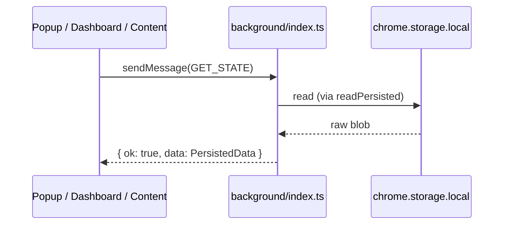
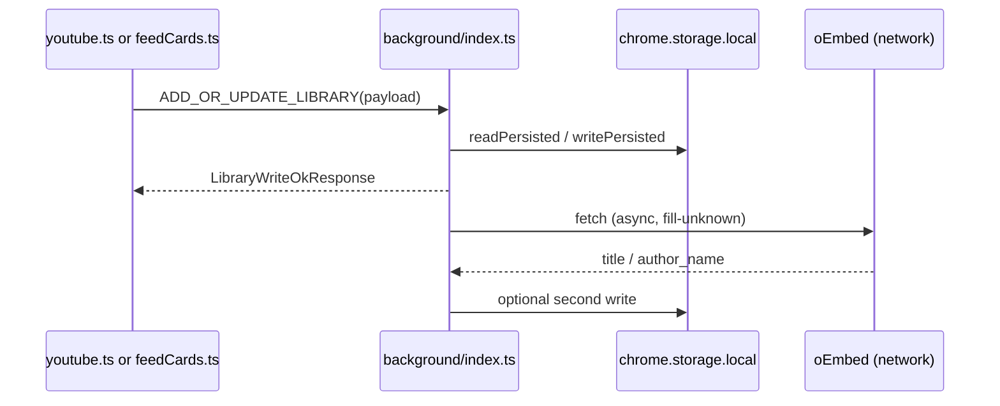
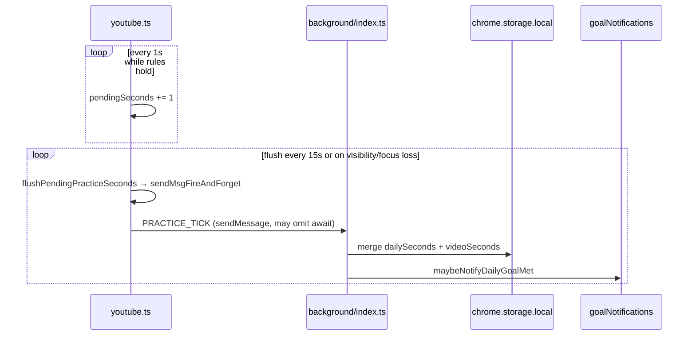

# ExplaneMe — project map for humans and AI

This document describes **JustPractice**, a Chrome MV3 extension: what each source file is for, how pieces connect, and rough **importance** / **complexity** scores. It also flags where **splitting into smaller files** would help maintenance.

> **Spelling:** the filename is `ExplaneMe.md` on purpose (per project request). If you prefer standard spelling, you could rename to `ExplainMe.md` and update references.

---

## How the extension fits together

- **Single source of truth:** `chrome.storage.local` under the key `jpPractice` (`STORAGE_KEY` in `src/lib/storage.ts`). Shape = `PersistedData` (library, daily/video practice seconds, settings, schema version).
- **Who writes storage:** almost always the **background service worker** (`src/background/index.ts`) after validating messages. Content scripts and pages send `chrome.runtime.sendMessage` payloads typed in `src/lib/messages.ts`.
- **Who reads storage for UI:** popup and dashboard call `GET_STATE` via messaging; the YouTube **content script** also uses `GET_STATE` (library refresh in `youtubeLibraryPanel.ts`, calendar snapshot in `youtubeWatchLifecycle.ts`) and listens to `chrome.storage.onChanged` for the storage key to refresh UI without spamming the background.
- **YouTube surface area:** one content script entry (`src/content/youtube.ts`) loads on YouTube; it pulls in feed thumbnail UI from `src/content/feedCards.ts`, **first-time panel host + wiring** from `src/content/youtubePanelMount.ts`, **watch-panel library GET_STATE / save / difficulty** flows from `src/content/youtubeLibraryPanel.ts`, **SPA navigation + storage resync orchestration** from `src/content/youtubeWatchLifecycle.ts`, panel markup from `src/content/youtubePanelHtml.ts`, **shadow-root panel render/update helpers** from `src/content/youtubePanelUi.ts`, **watch-page `chrome.runtime.sendMessage` helpers** from `src/content/youtubeMessaging.ts`, **optional panel debug logging** from `src/content/youtubeDebug.ts`, **SPA / player DOM hooks** from `src/content/youtubePlayerHooks.ts`, and **practice interval / flush helpers** from `src/content/youtubePracticeTimer.ts`.

```text
youtube.com tab
  └─ content script: youtube.ts ──► feedCards.ts (feed strip / popover)
        │                    ├────► youtubePanelMount.ts (ensure panel host, banners, home-feed strip)
        │                    ├────► youtubeLibraryPanel.ts (GET_STATE refresh, save, difficulty, flash)
        │                    ├────► youtubeWatchLifecycle.ts (onVideoChanged glue, calendar GET_STATE, storage.onChanged body)
        │                    ├────► youtubePanelHtml.ts (shadow DOM template)
        │                    ├────► youtubePanelUi.ts (calendar, goal ring, labels, drag)
        │                    ├────► youtubeMessaging.ts (sendMsg / fire-and-forget / async void guard)
        │                    ├────► youtubeDebug.ts (jpPracticeDebug strip + console log helpers)
        │                    ├────► youtubePlayerHooks.ts (nav events, player MutationObserver, feed-card tap pick)
        │                    └────► youtubePracticeTimer.ts (count/flush intervals + PRACTICE_TICK flush + page listeners)
        │
        └─ chrome.runtime.sendMessage ──► background/index.ts
                                              ├─ read/write storage.ts
                                              ├─ contextMenus (save from right-click)
                                              └─ goalNotifications.ts (alarms + optional notifications)

toolbar / options
  └─ popup/main.ts  ──► messaging ──► background
  └─ dashboard/main.ts ──► dashboardViewModel.ts + dashboardTemplates.ts + dashboardListeners.ts
        │                └─► messaging ──► background

Shared everywhere: messages.ts, storage types, i18n/, levelTags, practiceStats, etc.
```

---

## Ranking legend

**Importance (1–5)** — how risky or central the file is if you edit it wrong.

| Score | Meaning |
|-------|---------|
| 5 | Core contract: storage schema, message protocol, or background persistence |
| 4 | Primary user-facing behavior (watch panel, dashboard, major content UX) |
| 3 | Shared domain logic many files import |
| 2 | Focused helpers, templates, or secondary UI |
| 1 | Config, env types, or copy-only JSON |

**Complexity (1–5)** — how hard the file is to reason about (DOM quirks, state, migrations, not line count alone).

| Score | Meaning |
|-------|---------|
| 5 | Many interacting concerns or YouTube-specific fragility |
| 4 | Large stateful UI or non-trivial algorithms |
| 3 | Moderate logic; clear boundaries |
| 2 | Small module with a few exports |
| 1 | Almost trivial |

**Split?** — whether splitting would likely improve clarity **without** being mandatory.

---

## Root and tooling (not under `src/`)

| File | Purpose | Connects to | Imp. | Cplx. | Split? |
|------|---------|-------------|------|-------|--------|
| `manifest.config.ts` | MV3 manifest: permissions, background entry, content script matches, popup/options HTML. Consumed by Vite CRX plugin. | All entrypoints listed inside it | 5 | 2 | No |
| `vite.config.ts` | Build: `@crxjs/vite-plugin`, stable `assets/[name].js` output names (avoids broken chunk URLs on YouTube). | `manifest.config.ts`, entire `src/` graph | 5 | 2 | No |
| `vitest.config.ts` | Runs `src/**/*.test.ts` (default env **node**; individual tests can set `jsdom`). | Test files | 2 | 1 | No |
| `tsconfig.json` | Strict TS; `chrome` types; **excludes** `**/*.test.ts` from typecheck (tests still run under Vitest). | All TS | 3 | 1 | No |
| `eslint.config.js` | Lint rules for the repo. | All TS/JS | 2 | 1 | No |
| `package.json` | Scripts: `dev`, `build` (tsc + vite), `test`, `lint`. | Tooling | 2 | 1 | No |
| `README.md` | Human-oriented product + dev instructions. | — | 1 | 1 | No |

---

## `src/` — library (`src/lib/`)

| File | Purpose | Connects to | Imp. | Cplx. | Split? |
|------|---------|-------------|------|-------|--------|
| `storage.ts` (~405 lines) | **`PersistedData`** shape, `STORAGE_KEY`, normalization, migrations, `readPersisted` / `writePersisted`, goal + settings defaults. **Schema version** lives here. | Imported by background, dashboard, popup, content scripts; `UiLocale` used by `i18n/` | 5 | 4 | **Maybe** — types/constants vs migration vs I/O helpers |
| `messages.ts` | **`MSG`** string constants + TypeScript message/response types for `chrome.runtime.sendMessage`. | Background switch; every caller of `sendMessage` | 5 | 3 | No — keep protocol in one place |
| `extensionMessaging.ts` | Detects “benign” extension errors (invalidated context, missing receiver) for UI error handling. | `youtubeMessaging.ts`, `feedCards.ts` | 3 | 1 | No |
| `levelTags.ts` | JLPT/CEFR/custom tag lists, legacy detection, `tagsForFramework`, context-menu parsing helpers. | Background menus, all UIs that show levels | 4 | 3 | No |
| `practiceStats.ts` | Aggregations: streaks, calendar visuals, duration formatting, buckets for stats views. | `youtube.ts`, `youtubePanelUi.ts`, `dashboard/dashboardViewModel.ts` + `dashboardTemplates.ts`, `popup/main.ts`, `goalNotifications.ts` | 4 | 4 | **Maybe** — pure “date math” vs “presentation strings” |
| `goalFormat.ts` | SVG ring / goal progress line formatting shared between watch panel and dashboard. | `youtubePanelUi.ts`, `dashboard/dashboardFormatters.ts` | 3 | 2 | No |
| `goalNotifications.ts` | `chrome.alarms` scheduling + optional `chrome.notifications` for daily goal / nudge; uses Vite `?url` import for notify icon. | `background/index.ts` | 4 | 3 | No |
| `youtubeIds.ts` | Parse video IDs from URLs and DOM; **`resolveYoutubeVideoIdFromPage`** and related helpers (high YouTube churn). | `youtube.ts`, `feedCards.ts`, background | 4 | 4 | **Maybe** — URL parsing vs DOM scraping modules |
| `youtubeMeta.ts` | Thumbnail URL helper from `videoId`. | Popup + `dashboard/dashboardTemplates.ts` (library cards) | 2 | 1 | No |
| `htmlEscape.ts` | Safe string escaping for injected HTML. | Any file building HTML strings | 3 | 1 | No |
| `branding.ts` | `APP_NAME` constant. | Menus, UI chrome | 2 | 1 | No |
| `vite-env.d.ts` | Vite client type refs. | Build | 1 | 1 | No |
| `*.test.ts` | Unit tests: `youtubeIds`, `storage`, `levelTags`, `practiceStats` (under `src/lib/`); **`youtubePracticeTimer`** eligibility + flush (`src/content/youtubePracticeTimer.test.ts`). | Matching modules above | 3 | 2 | N/A |

---

## `src/i18n/`

| File | Purpose | Connects to | Imp. | Cplx. | Split? |
|------|---------|-------------|------|-------|--------|
| `index.ts` | `createTranslator`, `resolveLocale`, merges locale JSON with English fallback. `MessageKey` derived from `en.json`. | Every UI surface + background for menu labels | 4 | 3 | No |
| `localeMeta.ts` | Supported locale list, dropdown metadata, `formatLocaleOptionLabel`. | `index.ts`, `dashboard/dashboardTemplates.ts` | 3 | 2 | No |
| `locales/en.json` … `de.json` | UI strings; **English is the key set of record**; others overlay missing keys via merge in `index.ts`. | `index.ts` | 3 | 1 | No — keep JSON per language |

---

## `src/content/` (injected into YouTube pages)

| File | Lines (approx.) | Purpose | Connects to | Imp. | Cplx. | Split? |
|------|-----------------|---------|-------------|------|-------|--------|
| `youtube.ts` | ~594 | Main content script: boot, practice intervals; delegates **`onVideoChanged`**, calendar **`GET_STATE` refresh**, and **`chrome.storage.onChanged`** bodies to `youtubeWatchLifecycle.ts`. **Panel mount** → `youtubePanelMount.ts`; **library panel messaging** (`GET_STATE` refresh, save, difficulty, post-write flash) → `youtubeLibraryPanel.ts`; **panel paint** → `youtubePanelUi.ts`. **Debug** → `youtubeDebug.ts`; **practice ticks** → `youtubePracticeTimer.ts` + `youtubeMessaging.ts`; **SPA/player/feed pick** → `youtubePlayerHooks.ts`. Calls `initFeedCards`. | `feedCards.ts`, `youtubePanelMount.ts`, `youtubeLibraryPanel.ts`, `youtubeWatchLifecycle.ts`, `youtubePanelHtml.ts`, `youtubePanelUi.ts`, `youtubePracticeTimer.ts`, `youtubeMessaging.ts`, `youtubeDebug.ts`, `youtubePlayerHooks.ts`, most of `lib/` + `i18n/` | 5 | 5 | **Yes** — remaining: **`boot()`** wiring / one-shot init vs domain handlers if `youtube.ts` still feels crowded |
| `youtubeWatchLifecycle.ts` | ~67 | **`runWatchPanelOnVideoChanged`** (flush + rebind + no-video vs has-video flows), **`refreshWatchPanelCalendarSnapshot`** (`GET_STATE` → daily snapshot callback), **`runWatchPanelAfterJpPracticeStorageChange`** (settings fast-path + post-resync pipeline). Injected step implementations live in `youtube.ts`. | `youtube.ts`, `messages`, `storage` types, `youtubeMessaging.ts` (`sendMsg`) | 4 | 3 | No — keep orchestration thin; grow `youtube.ts` boot split instead |
| `youtubeLibraryPanel.ts` | ~224 | `refreshWatchPanelLibraryUiFromRemoteState`, `saveWatchPanelVideoToLibrary`, `applyWatchPanelDifficultyChange`, `flashWatchPanelAfterLibraryWrite`; uses `sendMsg` from `youtubeMessaging.ts`. | `youtube.ts`, `youtubePanelMount.ts`, `youtubePanelUi.ts`, `messages`, `storage`, `i18n` | 4 | 3 | **Maybe** — pure message helpers vs DOM if it grows |
| `youtubePanelMount.ts` | ~256 | `ensureWatchPanelIfAbsent` (host + shadow + listeners), `updateWatchPanelHint`, `setWatchPanelStatusFlash`, library banner show/clear + timer, `needsHomeFeedPanelAttention`, `updateHomeFeedAttentionStrip`, `applyNoVideoHomePanelLayout`. | `youtube.ts`, `youtubePanelHtml.ts`, `youtubePanelUi.ts`, `storage` types | 4 | 3 | **Maybe** — split banners vs mount if it grows |
| `youtubeDebug.ts` | ~59 | `JP_PRACTICE_DEBUG_LS_KEY`, `jpWatchDebugEnabled`, `jpWatchLog`, `createJpWatchPanelDebugStrip` (shadow `[part="jp-debug-strip"]`). | Imported by `youtube.ts` only | 2 | 2 | No |
| `youtubeMessaging.ts` | ~30 | `sendMsg`, `sendMsgFireAndForget`, `fireAsyncWatch` for the watch content script (benign-extension error handling). | `youtube.ts`, `youtubeLibraryPanel.ts`, `youtubeWatchLifecycle.ts` | 3 | 2 | No |
| `youtubePlayerHooks.ts` | ~103 | `getVideoElement`, `attachYoutubeNavHooks`, `attachYoutubePlayerDomHooks`, `attachHomeFeedPointerPick` (uses `pickFeedCardFromInteractionTarget`). | `youtube.ts`, `feedCards.ts` | 4 | 4 | **Maybe** — split nav vs observer vs pointer pick if it grows |
| `youtubePracticeTimer.ts` | ~114 | `shouldCountPracticeTime`, `flushPendingPracticeSeconds`, `createPracticeIntervalController`, `attachPracticePageFlushListeners`; constants `PRACTICE_*_INTERVAL_MS`. Unit-tested eligibility + flush. | Imported by `youtube.ts` only | 4 | 3 | **Maybe** — split pure math vs DOM listeners only if file grows |
| `feedCards.ts` | ~738 | Home/subscriptions/search **thumbnail strip**: hover UI, level picker, save/remove via messaging; coordinates “picked” video meta with watch panel when URL has no id. | `youtube.ts`, `youtubePlayerHooks.ts`, `messages`, `storage` types, `youtubeIds`, `extensionMessaging` | 4 | 5 | **Maybe** — DOM scan/mount vs popover UI vs messaging |
| `youtubePanelHtml.ts` | ~377 | Inner HTML/CSS for the shadow-root panel (markup + styles in one module). | Imported by `youtubePanelMount.ts` (and indirectly `youtube.ts`) | 3 | 2 | **Maybe** — could separate **CSS** vs **HTML** if the string keeps growing |
| `youtubePanelUi.ts` | ~347 | `renderWatchPanelCalendar`, `paintCalStreak`, `updateDailyGoalRing`, `syncWatchPanelLabels`, `applyWatchPanelCollapsed`, `attachPanelDrag`, level-select HTML helpers; takes `shadowRoot` + state via parameters. | `youtube.ts`, `youtubePanelMount.ts`, `youtubeLibraryPanel.ts`; `levelTags`, `practiceStats`, `goalFormat`, `storage`, `htmlEscape`, `i18n` types | 4 | 4 | **Maybe** — calendar vs ring vs labels if it grows |

---

## `src/background/`

| File | Lines (approx.) | Purpose | Connects to | Imp. | Cplx. | Split? |
|------|-----------------|---------|-------------|------|-------|--------|
| `index.ts` | ~327 | `chrome.runtime.onMessage` router: library CRUD, settings, practice ticks, export/restore, `GET_STATE`; **context menus** for YouTube save; wires **goal** alarm listener. | `messages`, `storage`, `levelTags`, `youtubeIds`, `goalNotifications`, `i18n` | 5 | 4 | **Maybe** — `onMessage` handlers vs `contextMenus` builder vs alarm hooks |

---

## `src/popup/` and `src/dashboard/`

| File | Purpose | Connects to | Imp. | Cplx. | Split? |
|------|---------|-------------|------|-------|--------|
| `popup/index.html` + `popup/main.ts` (~317) + `popup.css` | Toolbar popup: compact library list, filters, open dashboard link. | Messaging + same libs as dashboard (subset) | 4 | 3 | **Maybe** — render functions vs data loading |
| `dashboard/index.html` + `dashboard.css` | Options tab shell: `#app` mount + full-page styles. | `dashboard/main.ts` | 2 | 1 | No |
| `dashboard/main.ts` (~93) | Thin entry: `GET_STATE`, `buildDashboardViewModel`, fire-and-forget `ENRICH_LIBRARY_META` for unknown rows, `dashboardShellHtml`, **`attachDashboardListeners`**, debounced `storage.onChanged` → re-render. | `dashboardViewModel`, `dashboardTemplates`, `dashboardListeners`, messaging, `i18n` (load error only), `storage` (`STORAGE_KEY`) | 4 | 2 | No |
| `dashboard/dashboardViewModel.ts` | **`buildDashboardViewModel`** + **`DashView`**: sanitized level filter, practice aggregates, library rows, prebuilt filter-chip HTML, `navItemClass` / `viewPanelClass`. | `storage`, `practiceStats`, `levelTags`, `i18n`, `dashboardFormatters` | 4 | 3 | No |
| `dashboard/dashboardTemplates.ts` | **`dashboardShellHtml`** + section builders (sidebar, topbar, library, stats, goals, settings). | `dashboardViewModel`, `dashboardIcons`, `dashboardFormatters`, `practiceStats`, `youtubeMeta`, `i18n`, `branding` | 3 | 3 | **Maybe** — only if one section outgrows the file |
| `dashboard/dashboardListeners.ts` | **`attachDashboardListeners`** after each paint: nav, search, filters, settings/goals saves, export/restore/clear, remove, pause-unfocused. | `messages`, `storage` (types + helpers), `i18n`, `dashboardViewModel` (`vm.t`), `dashboardFormatters` (parsers) | 4 | 3 | No |
| `dashboard/dashboardFormatters.ts` | Pure helpers: level/search matching, welcome block, streak/goal strings, **`goalRingCardHtml`**, input parsers used by listeners. | `storage`, `levelTags`, `goalFormat`, `htmlEscape` | 3 | 2 | No |
| `dashboard/dashboardIcons.ts` | Inline SVG snippets for sidebar + topbar. | `dashboardTemplates` only | 2 | 1 | No |

> **Dashboard import graph (not drawn above):** `main.ts` imports only `dashboardViewModel`, `dashboardTemplates`, and `dashboardListeners`. **`dashboardFormatters.ts`** and **`dashboardIcons.ts`** are pulled in by those three modules (not by `main.ts` directly).

---

## Assets

| Path | Purpose | Imp. | Cplx. | Split? |
|------|---------|------|-------|--------|
| `src/assets/notify.png` (import in `goalNotifications.ts`) | Notification icon URL via Vite `?url`. The repo layout should include this path so the build can resolve the asset. | 2 | 1 | N/A |

---

## Quick “where do I change X?”

| Goal | Start here |
|------|------------|
| New message type between UI and background | `src/lib/messages.ts` + handler in `src/background/index.ts` + callers |
| Persisted field / migration | `src/lib/storage.ts` (+ bump `SCHEMA_VERSION` if needed) |
| YouTube page DOM / panel behavior | `src/content/youtube.ts` (+ `youtubePanelMount.ts`, `youtubeLibraryPanel.ts`, `youtubeWatchLifecycle.ts` for SPA/storage/calendar orchestration, `youtubePanelHtml.ts`, `youtubePanelUi.ts`, `youtubeIds.ts`, `youtubePlayerHooks.ts` for player surface + SPA hooks, `youtubePracticeTimer.ts` for practice timing) |
| Feed thumbnail strip | `src/content/feedCards.ts` |
| Right-click save menus | `src/background/index.ts` (context menu section) + `levelTags.ts` |
| Stats math / streaks | `src/lib/practiceStats.ts` |
| Goal reminder notifications | `src/lib/goalNotifications.ts` + background alarm wiring |
| New UI string | `src/i18n/locales/en.json` first, then other locales |
| Dashboard options **markup** (library / stats / goals / settings HTML) | `src/dashboard/dashboardTemplates.ts` (+ `index.html` / `dashboard.css` for shell) |
| Dashboard **events** after each render | `src/dashboard/dashboardListeners.ts` |
| Dashboard **derived numbers** / filter chip HTML / nav active classes | `src/dashboard/dashboardViewModel.ts` |
| Build / permissions / entrypoints | `manifest.config.ts`, `vite.config.ts` |

---

## Part 2 — contracts, flows, and feature maps

Part 1 is the **file index**. Part 2 is the **behavior index**: what crosses process boundaries, what gets persisted, and where edge cases live. Keep this in sync when you change `messages.ts`, `storage.ts`, or `background/index.ts`.

### Persisted data (`jpPractice` / `PersistedData`)

All of this lives in `src/lib/storage.ts`. The background is the normal writer; restore clears and sets raw `chrome.storage.local`.

| Field | Role |
|-------|------|
| `schemaVersion` | Bumped when migrations run (`SCHEMA_VERSION`). |
| `library` | `LibraryItem[]` — `videoId`, `title`, `channel`, `addedAt`, `difficulty`, `completedAt` (Unix ms or null). |
| `extensionInstalledDateKey` | `yyyy-mm-dd` anchor for “missed practice” / streak semantics. |
| `dailySeconds` | Map `dateKey → seconds` for the practice timer (not watch history). |
| `videoSeconds` | Map `videoId → seconds` (same metric as daily). |
| `settings` | `AppSettings` — goals, framework, custom levels, `uiLocale`, panel position/collapse, `pauseWhenUnfocused`, goal notification prefs, etc. |

**Settings worth remembering for AI debugging**

- **`pauseWhenUnfocused`** — when true, practice seconds do not accrue unless the document has focus (see practice rules below).
- **`levelFramework` / `customLevels`** — drive every level picker and context menu rebuild after `SET_SETTINGS`.

---

### Message protocol (`MSG.*`)

Defined in `src/lib/messages.ts`; dispatched in `src/background/index.ts` inside `handleMessage`. Responses are always `ExtensionResponse` (`ok: true` variants or `{ ok: false, error }`).

| Message | Typical senders | Payload (summary) | Handler effect / response |
|---------|-----------------|-------------------|---------------------------|
| `GET_STATE` | Popup, dashboard, `youtube.ts` / `youtubeLibraryPanel.ts` / `youtubeWatchLifecycle.ts`, `feedCards.ts` | none | `{ ok: true, data: PersistedData }` — read normalized storage. |
| `ADD_OR_UPDATE_LIBRARY` | Panel, feed strip, context menu click | `videoId`, `title`, `channel`, optional `difficulty` | Upsert library row; async oEmbed enrich (`fill-unknown`); returns **`LibraryWriteOkResponse`** (`libraryAction`, final title/channel/difficulty). |
| `REMOVE_LIBRARY` | UIs removing a save | `videoId` | Filter library; `{ ok: true }`. |
| `SET_DIFFICULTY` | Panel / library UIs | `videoId`, `difficulty` | Patch existing row only; `{ ok: true }`. |
| `SET_LIBRARY_COMPLETION` | Watch panel, Completed tab | `videoId`, `complete`, optional `title`/`channel` | Sets or clears `completedAt`; upserts library row when marking complete on an unsaved video; `{ ok: true }`. |
| `PRACTICE_TICK` | Watch script: `youtube.ts` → `flushPendingPracticeSeconds` (`youtubePracticeTimer.ts`) → `sendMsgFireAndForget` (`youtubeMessaging.ts`) | `videoId`, `deltaSeconds`, `endedAtMs` | Clamps delta to `MAX_TICK_SECONDS` (120); adds to `dailySeconds[dateKey]` and `videoSeconds`; may trigger **daily goal met** notification path; `{ ok: true }`. |
| `SET_SETTINGS` | Dashboard (and any caller) | `Partial<AppSettings>` | Merges with `ensureSettingsShape`; deep-merge `goals`; **rebuilds context menus**; `{ ok: true }`. |
| `ENRICH_LIBRARY_META` | UI that wants title/channel refresh | `videoId` | oEmbed **`overwrite`** mode; `{ ok: true }`. |
| `CLEAR_ALL_EXTENSION_DATA` | Dashboard reset | none | `emptyPersisted()` + re-arm goal alarm; `{ ok: true }`. |
| `RESTORE_EXTENSION_STORAGE` | Dashboard import | full `chrome.storage.local` object | Validates shape; `storage.local.clear()` then `set()`; normalizes `jpPractice` key; `{ ok: true }` or error. |

**OEmbed enrichment** (`background/index.ts`): after library writes from unknown title/channel (e.g. context menu), the background fetches YouTube oEmbed to fill in metadata when still placeholder or empty.

---

### Sequence diagrams (mermaid)

**Read path (any UI → background → storage)**



**Library save (happy path)**



**Practice tick (client accumulates, background persists)**



---

### Feature: practice time counting (watch / Shorts panel)

**Where the rules live:** Eligibility in **`src/content/youtubePracticeTimer.ts`** (`shouldCountPracticeTime`). **`youtube.ts`** owns `pendingSeconds`, `tickSecond` (invokes **`updateDailyGoalRing`** / calendar render from **`youtubePanelUi.ts`** when the UI should refresh), a thin **`flushPractice`** that delegates to **`flushPendingPracticeSeconds`**, and wires **`createPracticeIntervalController`** + **`attachPracticePageFlushListeners`**. Actual `sendMessage` calls use **`src/content/youtubeMessaging.ts`**.

**User-facing toggle:** “Count practice time” in the panel drives `practiceEnabled` (local variable synced from checkbox / state).

**When a second counts** (`shouldCountPracticeTime`):

1. Practice toggle on and `currentVideoId` set.
2. A `<video>` element exists and is **playing** (not `paused`, not `ended`).
3. `document.visibilityState === 'visible'`.
4. If `settings.pauseWhenUnfocused` is true, `document.hasFocus()` must be true.

**Transport:** Seconds accrue into `pendingSeconds` every **1000 ms** (`PRACTICE_COUNT_INTERVAL_MS`). They are sent to the background via **`flushPendingPracticeSeconds`** (invoked from **`flushPractice`**), on a **15 s** interval (`PRACTICE_FLUSH_INTERVAL_MS`), when the tab hides, or when focus policy causes a flush (`attachPracticePageFlushListeners`: `visibilitychange` / `blur` / `beforeunload`). Background clamps each tick to **120 s** max (`MAX_TICK_SECONDS` in background).

**Why this matters for AI:** Bugs here are “time drift”, “double counting”, or “ticks after unload” — always check **`createPracticeIntervalController.reset()`** paths and page flush listeners when changing practice behavior.

---

### Feature: library (save / remove / level / metadata)

**Writers**

- **Floating panel** (`youtube.ts` + `youtubeLibraryPanel.ts`): save, remove, difficulty change; uses real title/channel from DOM when available.
- **Feed cards** (`feedCards.ts`): save from thumbnail strip; messaging same as panel.
- **Context menu** (`background/index.ts` `onClicked`): resolves `videoId` from `linkUrl` or tab URL; starts with Unknown title/channel then oEmbed fills.

**Readers**

- Popup and dashboard render `GET_STATE` → `library`.
- Content scripts keep a **Set of videoIds** (feed) or full state (panel) updated via `GET_STATE` + `chrome.storage.onChanged` on `STORAGE_KEY`.

**`LibraryWriteOkResponse`:** UI uses `libraryAction === 'inserted' | 'updated'` to decide whether to flash “saved” vs stay quiet on pure updates (`flashWatchPanelAfterLibraryWrite` in `youtubeLibraryPanel.ts`, thin wrapper in `youtube.ts`).

---

### Feature: goals and notifications

**Settings:** `AppSettings.goals` (daily / weekly / monthly targets in **seconds**), `goalNotificationsEnabled`, `goalNudgeHourLocal`, `lastNotifiedGoalMetDate`, `lastNotifiedGoalNudgeDate`.

**Alarm:** `src/lib/goalNotifications.ts` — `ensureGoalCheckAlarm` creates a repeating alarm; `background/index.ts` listens with `chrome.alarms.onAlarm` and runs `runPeriodicGoalChecks`.

**After practice write:** `PRACTICE_TICK` merges deltas into an in-memory `PersistedData`, `writePersisted(p)`, then `maybeNotifyDailyGoalMet(p)` so the check sees **today’s** totals including this tick (see `background/index.ts` and `goalNotifications.ts`).

**Permissions:** `notifications` in manifest; code defensively checks `chrome.permissions.contains`.

---

### Feature: context menus (right‑click save)

**Registration:** `rebuildContextMenusFromStorage` in `background/index.ts` — serialized chain to avoid Chrome duplicate-id races.

**Data:** Reads persisted framework + custom levels, uses `createTranslator(resolveLocale(uiLocale))` for the “Unrated” label, builds one root + children per level.

**Click path:** `chrome.contextMenus.onClicked` → `parseContextMenuDifficulty` (`levelTags.ts`) → `handleMessage(ADD_OR_UPDATE_LIBRARY)` with placeholder title/channel.

---

### Feature: feed thumbnail strip + “home pick” binding

**Module:** `src/content/feedCards.ts`, bootstrapped from `youtube.ts` via `initFeedCards`.

**Problem it solves:** On pages **without** a watch URL `v=` id, the floating panel still needs a **bound video** for save/practice. Tapping a feed card sets internal meta via **`attachHomeFeedPointerPick`** in `youtubePlayerHooks.ts` (which calls `pickFeedCardFromInteractionTarget`); `youtube.ts` holds `homePickMeta` and coordinates with `VideoMeta`.

**Fragility:** YouTube DOM changes often — scan debounce, mount attributes, and shadow DOM for the popover are all high-churn code.

---

### Chrome extension gotchas (checklist for AI)

| Symptom | Likely cause | Code direction |
|---------|--------------|----------------|
| `Extension context invalidated` | Extension reload while tab open | `extensionMessaging.ts` treats as benign; UI should no-op or soft-fail. |
| No response / port closed | Background asleep or message invalid | Ensure `return true` in `onMessage` async path (already used). |
| `tsc` passes but tests fail | `*.test.ts` excluded from `tsconfig.json` include | Run `npm test`; fix tests separately from `tsc`. |
| Stale UI after storage change | Missing `storage.onChanged` listener | Panel listens for `STORAGE_KEY`; new UIs should follow the same pattern. |

---

### Maintenance

When you complete a large refactor, update **Part 1** table rows (Imp. / Cplx. / Split) and **Part 2** diagrams or message tables if behavior changes.

Optional later: a small script or test that asserts every `MSG.*` value has a `handleMessage` branch (guards against drift between `messages.ts` and `background/index.ts`).
