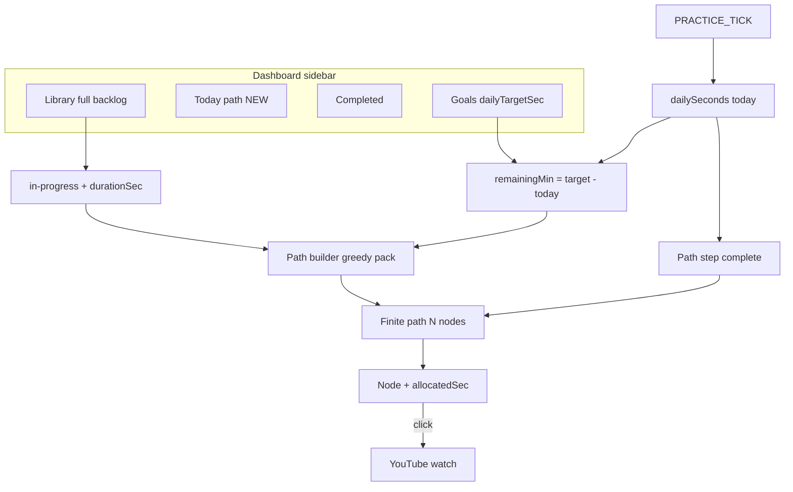

# Daily Path — Product & UX Design Spec

**Status:** Phase B (MVP) implemented — polish in Phase C  
**Last updated:** 2026-06-03 (rev 2 — dynamic today path)  
**Audience:** Product, design, and engineering before building the dashboard tab  

---

## Table of contents

1. [One-line pitch](#1-one-line-pitch)
2. [Why this tab exists](#2-why-this-tab-exists)
3. [Product decisions (locked)](#3-product-decisions-locked)
4. [User stories](#4-user-stories)
5. [Information architecture](#5-information-architecture)
6. [Path builder algorithm](#6-path-builder-algorithm)
7. [Visual design](#7-visual-design)
8. [Interactions](#8-interactions)
9. [Copy & i18n](#9-copy--i18n)
10. [Edge cases & empty states](#10-edge-cases--empty-states)
11. [Ask & Answer appendix](#11-ask--answer-appendix)
12. [Technical sketch (for implementers)](#12-technical-sketch-for-implementers)
13. [Success metrics](#13-success-metrics)
14. [Phased rollout](#14-phased-rollout)
15. [Open questions](#15-open-questions)

---

## 1. One-line pitch

**A Duolingo-style, finite “today” path on the dashboard: the extension picks the fewest saved videos whose lengths cover your remaining daily watch goal, so you always know exactly what to open next to cross the finish line.**

---

## 2. Why this tab exists

### 2.1 Problems today

| Problem | Where it shows up | User impact |
|--------|-------------------|-------------|
| **“What should I watch?”** | [Library view](../src/dashboard/dashboardTemplates.ts) is a **grid of cards** — great for browsing, weak for picking the *next* action | Decision fatigue; opens YouTube without a plan |
| **Daily goal is disconnected from video choice** | Progress lives on the **watch panel ring** and **Goals** tab | User sees “12 min left” but not *which videos* get them there |
| **Backlog feels infinite** | Every saved video looks equally “next” | Overwhelm; no sense of a finish line for *today* |
| **Motivation backlog** | [MotivationIdeas.md](../MotivationIdeas.md) #4 (“Next up queue”) and #19 (“Study plan”) | Same gap, already identified internally |

### 2.2 What this tab optimizes for

- **Cost-efficient finish line** — show only enough videos to cover **remaining** daily minutes (e.g. 30 min goal → one 17 min + one 15 min video = **2 nodes**, not 40).
- **Today-only plan** — not an infinite library map; the path is **regenerated** when the daily goal is met or the user asks for a new plan.
- **One obvious “current” step** — first incomplete **path step**, with **START** (Duolingo reference).
- **Daily goal context** — sticky header: practiced today vs target, minutes left, and how many videos are on *this* plan.

### 2.3 What it does NOT replace

| Existing surface | Role |
|------------------|------|
| **Library** | Full backlog: search, filter, add/remove, all in-progress videos |
| **Completed** | Videos marked done forever (`completedAt`) |
| **Goals** | Set daily / weekly / monthly targets |
| **Stats / Progress** | Aggregates, heatmap, XP |
| **YouTube watch panel** | Live counting, save to library, mark complete |

**Practice counting is unchanged:** saved library videos + visible tab + playback meter → `PRACTICE_TICK` → `dailySeconds` (see [practicePlaybackMeter.ts](../src/content/practicePlaybackMeter.ts)).

### 2.4 Design reference

Duolingo’s learning path (user-provided screenshot):

- **Finite** vertical trail for the current unit — not the entire course catalog.
- **Completed** = gold + checkmark.
- **Active** = green + **START**.
- **Upcoming** = muted nodes on the same short path.

JustPractice adapts this: **each circle = one video on today’s plan**, not every saved video.

---

## 3. Product decisions (locked)

Confirmed with the product owner (rev 2 supersedes rev 1 “all in-progress on path”).

| Question | Decision |
|----------|----------|
| **What is the path?** | A **today-only, finite plan** to reach the daily watch-time goal — not an infinite backlog trail |
| **Which videos appear?** | **Dynamic subset** of in-progress library videos whose **durations sum to ≥ remaining minutes today** (greedy pack; see §6) |
| **Scope of “remaining”** | `dailyTargetSec − todayPracticeSec` (already practiced today reduces the plan) |
| **When is a path node “done”?** | User has logged enough **practice time on that video for this path step** (allocated slice met) — **not** the same as “mark complete” in library (see §5.6) |
| **When is the whole path “done”?** | Daily goal met **or** all path steps completed — then offer **“New path”** for optional extra practice |
| **Where does it live?** | Dashboard sidebar view **Today** (`path`). Not popup. Not watch panel |
| **Locks between steps?** | **No** in v1 — user may open any node on the plan; visual “active” stays on first incomplete step |
| **Video duration source** | **Required for v1:** cached `durationSec` per `videoId` (see §5.3) — `LibraryItem` does not have this today |
| **Persistence** | **Yes for v1:** `durationSec` on library items (or side map) + optional cached **today’s path plan** (`videoId[]` + `dateKey`) so the plan does not reshuffle on every refresh |

---

## 4. User stories

### US-1 — See today’s finish line

**As** a learner with a 30-minute daily goal who has practiced 8 minutes today,  
**I want** the header to show **22 min left** and my progress ring,  
**So that** the path is built against the remainder, not the full 30.

**Acceptance**

- `remainingSec = max(0, dailyTargetSec − todayPracticeSec)`.
- Header uses same `dailySeconds[todayKey]` as dashboard goal rings.

### US-2 — Short, goal-sized path

**As** a learner with a 30-minute goal left and videos of 17 min and 15 min,  
**I want** the path to show **only those 2 videos**,  
**So that** I am not scrolling through 50 saves.

**Acceptance**

- Path node count = result of path builder (§6), not `library.length`.
- Example: 17 + 15 ≥ 30 → exactly 2 nodes (unless tie-break rules add none).

### US-3 — Know what to watch next

**As** a learner on a 2-hour daily goal,  
**I want** a small set of videos whose **total length reaches ~2 hours** of remaining time,  
**So that** I can cross the line without guessing.

**Acceptance**

- Sum of **allocated** durations on path ≥ `remainingSec` (within tolerance; see §6.4).
- Header may show: `5 videos · about 2h planned`.

### US-4 — Open a video from the path

**As** a learner,  
**I want** to click a node and open that YouTube video,  
**So that** I can start immediately.

**Acceptance**

- Opens `https://www.youtube.com/watch?v={videoId}` in a new tab, matching [library cards](../src/dashboard/dashboardTemplates.ts).

### US-5 — Path step completes when I practice enough

**As** a learner,  
**When** I have practiced at least this step’s **allocated minutes** on that video (today or total — see §5.6),  
**I want** the node to turn gold and the next node to become active,  
**So that** the path tracks today’s plan even if I never tap “mark complete.”

**Acceptance**

- Path step complete ≠ library `completedAt` (unless we explicitly sync later — not v1).
- Daily goal still advances via existing `PRACTICE_TICK` regardless of path step state.

### US-6 — New path after goal met

**As** a learner who just hit the daily goal,  
**I want** to celebrate and optionally tap **“New path”** for more practice,  
**So that** today’s plan feels finished, not endless.

**Acceptance**

- Goal met: path hidden or empty state + CTA “New path” / “You’re done for today.”
- New path: rebuild with `remainingSec = 0` → optional “extra practice” plan (e.g. one more video) or message that goal is done.

### US-7 — No daily goal

**As** a learner without a daily goal,  
**I want** a clear prompt to set one (path needs a target),  
**So that** I understand why the planner is empty.

**Acceptance**

- No path built; header CTA → **Goals** view.
- Optional fallback (v2): suggest 1–3 “next” videos without duration math.

### US-8 — Empty or insufficient library

**As** a learner whose saved videos are too short to reach today’s remainder,  
**I want** an honest message,  
**So that** I know to save longer videos or keep practicing off-path.

**Acceptance**

- Show best-effort path + “You’re ~X min short; save more videos or practice any library video.”

### US-9 — Single-node path

**As** a learner where one video length ≥ remaining (e.g. 3h video, 30 min left),  
**I want** one node with **allocated 30 min** (not “watch entire 3h” for the plan),  
**So that** the plan stays honest.

**Acceptance**

- One centered node; allocation capped at `remainingSec`.

---

## 5. Information architecture

### 5.1 Placement in the app



**Nav order:** Library → **Today** → Completed → …

### 5.2 View identity

| Property | Value |
|----------|--------|
| Internal `DashView` id | `path` |
| User-facing label | **Today** |
| i18n prefix | `nav.path`, `path.*` |

### 5.3 Data sources

| UI element | Source | Notes |
|------------|--------|--------|
| Candidates | `inProgressLibraryItems(library)` | `completedAt === null` |
| Video length | **`durationSec`** per `videoId` | **New** — not in `LibraryItem` today; fetch on save / lazy refresh |
| Remaining today | `dailyTargetSec − dailySeconds[todayKey]` | Floor at 0 |
| Today practiced | `dailySeconds[todayKey]` | |
| Path plan | Built list `{ videoId, allocatedSec, durationSec }[]` | Cache per `dateKey` + `remainingSec` fingerprint optional |
| Path step progress | Compare `videoSeconds[videoId]` or **today-on-video** if added | See §5.6 |
| Thumbnail / title | Existing `LibraryItem` + `thumbnailUrlForVideoId` | |
| Goal met | `todaySec >= dailyTargetSec` | |

**Duration acquisition (v1 recommendation):**

1. On **save to library** (content script has page access): read `HTMLVideoElement.duration` or YouTube player metadata when available.
2. On **path build** if missing: background fetch oEmbed / InnerTube (rate-limited) or show “length unknown” and exclude from pack until known.
3. Store on `LibraryItem.durationSec` (nullable) — schema bump when implementing.

### 5.4 Path lifecycle (today)

| Event | Behavior |
|-------|----------|
| First open Today tab today | Build path from `remainingSec` + candidates with known duration |
| Practice time increases | Recompute step completion; if `remainingSec` hits 0 → goal met UI |
| User taps **Regenerate path** | Rebuild plan (new greedy result; confirm if mid-progress) |
| Goal met | Show celebration; default hide path; **New path** for extra practice |
| Midnight / date change | New `dateKey` → new plan |
| Mark library complete | Remove from candidates; may shrink pool for next regeneration |

### 5.5 Active node rule

- **Active** = first path step where step is not **completed** (allocated practice not yet met).
- User may click any node on the plan; active highlight stays on first incomplete step (Duolingo-style).

### 5.6 Three progress systems (explicit)

| System | Trigger | Purpose |
|--------|---------|---------|
| **Daily watch time** | `PRACTICE_TICK` while watching saved videos | `dailySeconds`, goal ring, streaks, XP |
| **Path step complete** | Practice on that video ≥ **`allocatedSec`** for this step (recommend: count **today only** once per-video today tracking exists; v1 may use lifetime `videoSeconds` delta since plan created — document in impl) | Gold node, advance active |
| **Library complete** | User marks complete → `completedAt` | **Completed** tab; removes video from future candidate pool |

They **can diverge**: user can hit the daily goal while path steps remain visually open if allocation math differs; prefer **recalculating remaining** and **auto-completing steps** when `PRACTICE_TICK` proves enough time on that video.

**Recommendation for v1 step completion:** step done when `practiceOnVideoSincePlanStart >= allocatedSec` OR when daily goal met (whichever comes first for that node). Do **not** require library mark-complete for path gold state.

---

## 6. Path builder algorithm

Pure function target: `buildTodayPath(candidates, remainingSec, options) → PathPlan`.

### 6.1 Inputs

- `candidates`: `{ videoId, durationSec, addedAt, ... }[]` — only `durationSec > 0` known
- `remainingSec`: integer ≥ 0
- `options`: `{ maxNodes?: number }` default `maxNodes = 12`

### 6.2 Greedy pack (v1 default)

1. If `remainingSec === 0` → empty plan (goal met).
2. Sort candidates (stable): **`addedAt` ascending** (oldest saved first), tie-break `durationSec` ascending (shorter first → fewer nodes).
3. Initialize `sum = 0`, `plan = []`.
4. For each candidate in order, if `sum >= remainingSec` stop.
5. Push node:
   - `allocatedSec = min(durationSec, remainingSec - sum)` on last node if overshooting?  
   - **Last node rule:** if `sum + durationSec > remainingSec` and this is the node that crosses the line, still add full video but **`allocatedSec = remainingSec - sum`** (user may watch more; plan only *needs* the remainder).
6. If after loop `sum < remainingSec` → **shortfall plan** (see §10).

**Example A — 30 min left**

| Video | durationSec |
|-------|-------------|
| A | 17 × 60 |
| B | 15 × 60 |

Greedy → A, B → sum 32 min ≥ 30 → **2 nodes**.

**Example B — 2 h left**

Greedy picks oldest videos until cumulative duration ≥ 7200s → might be 5 videos; header shows `5 videos · ~2h planned`.

**Example C — one 3 h video, 30 min left**

One node; `allocatedSec = 1800`, `durationSec = 10800`.

### 6.3 Alternatives (v2 settings)

| Mode | Behavior |
|------|----------|
| `fewestVideos` | Sort by `durationSec` desc first (bin-pack style) — minimize node count |
| `shortestFirst` | Minimize total over-watch |
| `userPinned` | Honor manual order then pack |

### 6.4 Tolerance

- Treat goal as met when `sum(allocations) >= remainingSec - 30` (30s slack) to avoid flicker from rounding.

### 6.5 Unknown duration

- Exclude from greedy; show in sidebar “X videos need length — open on YouTube to update.”
- Or include with fallback 10 min estimate (risky) — **prefer exclude** in v1.

---

## 7. Visual design

### 7.1 Layout zones

```
┌─────────────────────────────────────────────────────────────┐
│ Sidebar  │  TODAY                                             │
│          │  ┌──────────────────────────────────────────────┐│
│► Today   │  │ [ring]  48m / 120m  ·  72 min left            ││
│          │  │  2 videos · ~72 min planned                    ││
│          │  │  [ Regenerate path ]                           ││
│          │  └──────────────────────────────────────────────┘│
│          │  ┌──────────────────────────────────────────────┐│
│          │  │        ╭ START ╮                              ││
│          │  │       (★) 17 min                              ││
│          │  │         ╲                                       ││
│          │  │          (○) 15 min                             ││
│          │  └──────────────────────────────────────────────┘│
└──────────┴──────────────────────────────────────────────────┘
```

Short paths (2–8 nodes) rarely need long scroll; zig-zag still applies.

### 7.2 Node states

| State | Visual | Condition |
|-------|--------|-----------|
| `stepCompleted` | Gold + check | Allocated practice met (§5.6) |
| `active` | Green + START bubble | First incomplete step |
| `available` | Neutral + thumbnail | Later steps on plan |
| `locked` | Not used v1 | — |

**Per-node label:** title; subline `N4 · 17 min video · 8/17 min on this step` (optional progress).

### 7.3 Header states

| Condition | Copy |
|-----------|------|
| Goal in progress | `{done}/{target}` + `{remaining} left` + `{n} videos · ~{planned} planned` |
| Goal met | Celebration + “New path” / “Done for today” |
| No goal | Set daily goal CTA |
| Shortfall | “~{short} min short” + link Library |

### 7.4 Motion, a11y, tokens

Unchanged from rev 1 (see prior spec): zig-zag SVG, `prefers-reduced-motion`, `.path-*` CSS tokens, `<ol>` trail, anchor per node.

---

## 8. Interactions

| Action | Behavior |
|--------|----------|
| Click node | Open YouTube (new tab) |
| **Regenerate path** | Re-run builder; confirm if user has progress on current plan |
| **New path** (after goal met) | Build optional extra plan or show done state |
| Mark library complete | Removes from candidate pool on next build; does not auto-gold path unless step rules say so |
| Switch to Today tab | `GET_STATE` + build/restore cached plan |
| Storage sync | Update step completion + header; rebuild if remainder changed significantly (threshold TBD) |

---

## 9. Copy & i18n

| Key | English copy |
|-----|----------------|
| `nav.path` | Today |
| `path.subtitle` | Your shortest path across today’s watch goal. |
| `path.minutesLeft` | {minutes} min left today |
| `path.plannedSummary` | {count} videos · ~{duration} planned |
| `path.plannedSummaryOne` | 1 video · ~{duration} planned |
| `path.goalMet` | Daily goal met |
| `path.goalMetSub` | You crossed the line. Start a new path or call it a day. |
| `path.newPath` | New path |
| `path.regeneratePath` | Regenerate path |
| `path.regenerateConfirm` | Replace your current plan? Progress on these steps will reset. |
| `path.noGoal` | Set a daily goal to get today’s path |
| `path.shortfall` | You’re about {minutes} min short with your saved videos |
| `path.unknownDuration` | {count} videos need length — open once on YouTube |
| `path.emptyCandidates` | Save videos to your library to build a path |
| `path.nodeAllocated` | {allocated} of {duration} for this step |
| `path.stepCompleted` | Step complete |
| `path.nodeActive` | Current step |
| `path.startCallout` | START |

---

## 10. Edge cases & empty states

| Scenario | UX |
|----------|-----|
| No daily goal | No plan; CTA Goals |
| Goal met | Celebrate; hide plan or offer New path |
| 0 candidates | Empty save CTA |
| Unknown durations only | Explain; list videos to open |
| Sum durations < remaining | Shortfall message + partial path |
| 1 video ≥ remaining | 1 node, capped allocation |
| User regenerates mid-path | Confirm; new greedy set |
| Practice off-path library video | Still counts for daily goal; path unchanged |
| All steps done, goal not met | Rare (allocation math); rebuild or show remainder |
| 50+ candidates in library | Builder still picks ≤ `maxNodes`; library tab for full list |

---

## 11. Ask & Answer appendix

**Q1: Is this an infinite Duolingo map of my library?**  
**A:** No. It is a **finite today plan** sized to **remaining daily minutes**.

**Q2: How many videos show?**  
**A:** As many as the greedy pack needs — often **2–8**, not every save.

**Q3: 30 min left, videos 17 + 15 min — how many nodes?**  
**A:** **Two.**

**Q4: Does mark-complete on library gold the path?**  
**A:** Not required. Path steps use **allocated practice time**. Mark complete removes the video from **future** plans.

**Q5: Does watching count for the daily goal?**  
**A:** Yes — unchanged `PRACTICE_TICK` / `dailySeconds`.

**Q6: Can path and daily goal diverge?**  
**A:** Yes briefly; we should reconcile on tick (update remainder, complete steps when allocation met).

**Q7: Why store video duration?**  
**A:** `LibraryItem` has no length; planning “17 + 15 min” requires `durationSec`.

**Q8: What if I complete the goal before finishing path steps?**  
**A:** Goal met UI; offer **New path** or stop.

**Q9: Can I get another path after finishing?**  
**A:** Yes — **Regenerate** / **New path** (optional extra practice).

**Q10: Popup / watch panel path?**  
**A:** Not v1.

**Q11: No locks between steps?**  
**A:** Correct for v1.

**Q12: Library tab still needed?**  
**A:** Yes — full backlog, search, filters. Today is the **planner**.

**Q13: How often does plan rebuild?**  
**A:** On tab open, after goal met, on regenerate, and when remainder changes beyond slack (optional auto).

**Q14: RTL?**  
**A:** Mirror zig-zag in RTL.

**Q15: Rev 1 said all videos on path — what changed?**  
**A:** Rev 2: **dynamic subset for finish line** per product owner; rev 1 backlog model deprecated.

---

## 12. Technical sketch (for implementers)

### 12.1 New / changed modules

| File | Responsibility |
|------|----------------|
| `src/lib/pathBuilder.ts` | `buildTodayPath`, tests (17+15=30, shortfall, single node cap) |
| `src/lib/videoDuration.ts` | Read/cache `durationSec` on save |
| `src/dashboard/dashboardPathSection.ts` | HTML header + trail |
| `src/dashboard/dashboardPathLayout.ts` | Zig-zag positions, SVG connectors |

### 12.2 Schema (v1)

```typescript
// Extend LibraryItem
durationSec: number | null; // YouTube length, seconds

// Optional PersistedData
todayPathPlan?: {
  dateKey: string;
  remainingSecAtBuild: number;
  steps: { videoId: string; allocatedSec: number }[];
};
```

### 12.3 View model

```typescript
interface PathNodeVm {
  item: LibraryItem;
  durationSec: number;
  allocatedSec: number;
  practicedSecOnStep: number;
  state: 'stepCompleted' | 'active' | 'available';
  side: 'left' | 'right' | 'center';
}

pathNodes: PathNodeVm[];
pathActiveIndex: number | null;
remainingSec: number;
plannedTotalSec: number;
dailyGoalMet: boolean;
pathShortfallSec: number | null;
```

### 12.4 Dashboard integration

Same checklist as rev 1 (`DashView` `path`, sidebar, templates, CSS, i18n) plus:

- Call `buildTodayPath` in `buildDashboardViewModel`
- Wire **Regenerate path** in `dashboardListeners.ts`
- Duration backfill job on library items missing `durationSec`

---

## 13. Success metrics

| Metric | Signal |
|--------|--------|
| **Clarity** | User names next video + how many min left within 3s |
| **Right-sized plan** | Median path length ≤ 8 when goal set |
| **Goal completion** | Users with Today tab hit daily goal rate ↑ vs library-only |
| **No overwhelm** | Qualitative: “feels like a finish line” |

---

## 14. Phased rollout

| Phase | Scope |
|-------|--------|
| **A — Design** | This document (rev 2) |
| **B — MVP** | `durationSec` capture, `buildTodayPath`, Today tab, header, finite nodes, click-to-open, step completion, regenerate |
| **C — Polish** | Zig-zag SVG, animations, scroll-to-active, per-step progress ring |
| **D — Optional** | `fewestVideos` sort, pin/reorder, per-video today seconds, watch-panel “next on path” strip |

**Phase B exit criteria**

- [x] Path length = greedy result, not full library
- [x] 30 min remainder + 17+15 min videos → 2 nodes
- [x] `remainingSec` decreases as user practices
- [x] Goal met → celebration + New path (extra-practice rebuild on **New path**)
- [x] `durationSec` stored for new saves (watch page + `SET_VIDEO_DURATION`)
- [x] Unit tests for `pathBuilder.ts` and `todayPath.ts`

---

## 15. Open questions

### Resolved (rev 2)

- Finite **today** path, not infinite backlog  
- **Greedy pack** to remaining daily minutes  
- **Dynamic** video count (e.g. 2 for 30 min)  
- **Regenerate / new path** after goal  
- **`durationSec`** required  
- Path step done = **allocated practice**, not library mark-complete  

### Deferred

- Per-video **today-only** seconds (cleaner step math)  
- `fewestVideos` bin packing  
- User pin / manual order  
- Duolingo sections + locks  
- Mascot  
- Popup mini-path  

---

## Related documents

- [ExplaneMe.md](../ExplaneMe.md)  
- [MotivationIdeas.md](../MotivationIdeas.md)  
- [AGENT-HANDOFF-practice-counting-and-ring-animation.md](../AGENT-HANDOFF-practice-counting-and-ring-animation.md)  

---

## Revision history

| Date | Change |
|------|--------|
| 2026-06-03 | Initial design spec (rev 1 — full in-progress backlog) |
| 2026-06-03 | **Rev 2** — dynamic today path, greedy pack to remaining goal, `durationSec`, path step vs library complete, regenerate/new path |
