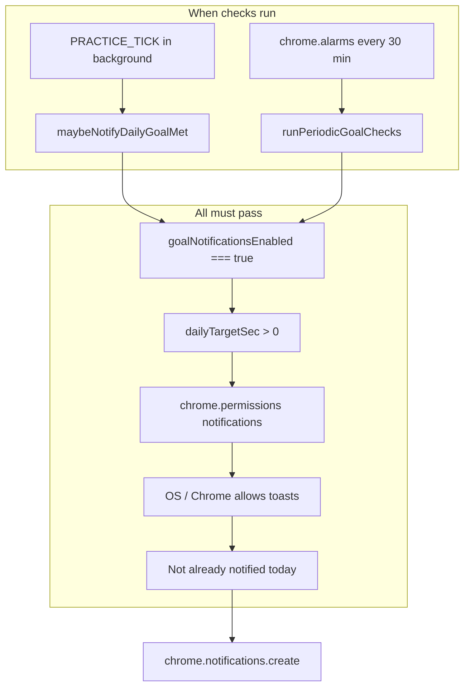

# Goal reminders — why they may not work

> **Status (2026-06-06):** Feature **removed** from the product (Goals tab UI + background alarms/notifications). This doc is kept as historical context. Rank/achievement notifications in Settings are unchanged.

**Report date:** 2026-06-06  
**Scope:** Goals tab → **Reminders** (enable checkbox + evening nudge hour) — *removed*  
**Former code:** `src/lib/goalNotifications.ts` (deleted), `src/background/index.ts`, `src/dashboard/dashboardListeners.ts`

---

## Summary

Goal reminders are **real features**, not UI-only — but they depend on several conditions that are easy to miss, and the implementation has **UX and reliability gaps** that can make reminders appear “broken” even when the checkbox is on.

Most likely reasons a user sees **no notification**:

1. **No daily practice target saved** (minutes field empty / never clicked **Save targets**).
2. **Chrome or the PC was not running** at/after the nudge hour (checks are not push notifications from a server).
3. **Windows or Chrome blocked extension notifications** (OS Focus Assist, Chrome site settings).
4. **A failed notification still marks the day as “already nudged”** (code bug — see §5).
5. **Evening hour only persists when you click Save targets**, not when toggling reminders alone (UX bug — see §4).

---

## What the UI promises

From `dash.remindersHint` (Goals tab):

- When **Enable goal reminders** is on:
  - Browser notification when you **reach** your daily practice target.
  - **One evening reminder** if you have **not** reached the target.
- Evening time defaults to **8:00 PM local** (hour `20`) if the hour field is left blank.

---

## How it actually works (architecture)



| Piece | Location | Behavior |
|--------|----------|----------|
| Enable flag | `settings.goalNotificationsEnabled` | Default **`false`**. Must be explicitly `true`. |
| Evening hour | `settings.goalNudgeHourLocal` | `null` → treated as **20** (8 PM). |
| Goal-met notify | `maybeNotifyDailyGoalMet()` | Called after each `PRACTICE_TICK` that updates storage. |
| Evening nudge | `runPeriodicGoalChecks()` | Alarm `jp-practice-goal-checks` every **30 minutes**. |
| Alarm wiring | `src/background/index.ts` | Created on service worker load + `chrome.runtime.onStartup`. |
| Dedup keys | `lastNotifiedGoalMetDate`, `lastNotifiedGoalNudgeDate` | One met + one nudge per local calendar day. |

Manifest (`manifest.config.ts`) includes `notifications` and `alarms` — the extension does **not** ask the user for notification permission at runtime; it assumes manifest permission is enough.

---

## Prerequisites checklist (user-facing)

For **any** reminder to fire:

| # | Requirement | How to verify |
|---|-------------|----------------|
| 1 | **Daily goal set** | Goals tab → minutes field filled → **Save targets** clicked. `dailyTargetSec` must be &gt; 0. |
| 2 | **Reminders enabled** | Checkbox **Enable goal reminders** on (saves immediately). |
| 3 | **Chrome running** | Alarms run in the extension service worker. Fully quitting Chrome stops checks until it restarts. |
| 4 | **Notifications allowed** | Windows: Settings → System → Notifications. Chrome: `chrome://settings/content/notifications` — allow for Chrome / extensions. |
| 5 | **For evening nudge only** | Local time ≥ nudge hour (default 20:00), goal **not** met today, and nudge not already sent today. |
| 6 | **For goal-met only** | Practice time today ≥ daily target (counted via library + practice timer → `dailySeconds`). |

---

## Code-level issues (why “it doesn’t work” from a product view)

### 1. Split save behavior (UX bug)

**File:** `src/dashboard/dashboardListeners.ts`

| Control | When it saves |
|---------|----------------|
| **Enable goal reminders** checkbox | Immediately on toggle (`SET_SETTINGS` with `goalNotificationsEnabled`). |
| **Evening nudge hour** input | Only when **Save targets** is clicked (`#save-goals`), together with daily minutes. |
| **Daily minutes** | Same — only on **Save targets**. |

**Impact:** A user can enable reminders, assume settings are saved, and never click **Save targets**. The checkbox persists, but **no daily goal** may be stored → **no notifications ever** (`dailyTargetSec` gate in `goalNotifications.ts` lines 89–90, 126–127).

Evening hour changes are also lost until **Save targets** is pressed.

---

### 2. Notifications marked “sent” even when `create()` fails (reliability bug)

**File:** `src/lib/goalNotifications.ts`

Both `maybeNotifyDailyGoalMet` and the evening nudge path:

```ts
try {
  await chrome.notifications.create(...);
} catch {
  /* ignore */
}
// Always runs — even if create threw:
fresh.settings.lastNotifiedGoalNudgeDate = todayKey; // or lastNotifiedGoalMetDate
await writePersisted(fresh);
```

**Impact:** If the OS blocks the toast, the icon URL is invalid, or Chrome rejects the notification, the extension **still records that it notified you today**. You will **not** get another attempt until the next calendar day.

This is a strong candidate for “I enabled it and never got anything” when the first silent failure consumed the daily slot.

---

### 3. 30-minute polling — not “at 8:00 PM sharp”

**Constant:** `GOAL_CHECK_ALARM_PERIOD_MIN = 30`

The evening nudge is only evaluated when the alarm fires. After hour ≥ nudge hour, the first qualifying alarm might be **up to ~30 minutes late**, depending on when the alarm was last scheduled and whether the service worker was awake.

**Impact:** Users expecting a prompt exactly at 8:00 PM may think reminders are broken.

---

### 4. Service worker / browser must be active

MV3 background is event-driven. Alarms wake the worker, but:

- If **Chrome is closed**, no checks run.
- If the machine **sleeps** through the evening window, the nudge may not fire until the next alarm **after** wake — still gated by “once per day” dedupe.

**Impact:** Not a server-push reminder; it is a **local scheduler inside Chrome**.

---

### 5. No runtime permission / diagnostics UI

The code checks `chrome.permissions.contains({ permissions: ['notifications'] })` but:

- Does **not** call `chrome.notifications.getPermissionLevel()` (where available).
- Does **not** surface errors to the dashboard.
- Failures in `notifications.create` are **swallowed**.

**Impact:** User has no in-app signal for “blocked at OS level” vs “no goal set” vs “already nudged today”.

---

### 6. Goal-met notification tied to practice persistence

**File:** `src/background/backgroundMessageHandlers.ts` — `maybeNotifyDailyGoalMet` runs after `PRACTICE_TICK` writes storage.

**Impact:** Goal-met toast appears when practice is **saved** through the normal tick path. If today’s seconds were only visible in the YouTube panel but not yet flushed to storage, met notification waits until the next tick (or the 30-minute periodic check if goal is already met in storage).

---

### 7. No automated tests

There are **no unit tests** for `goalNotifications.ts`. Regressions in alarm wiring, dedupe, or failure handling would not be caught by CI.

---

## Environmental factors (Windows 10/11)

Even with correct code and settings:

- **Focus Assist / Do Not Disturb** can suppress toasts.
- **Chrome notification settings** per-profile.
- **Extension not pinned / background throttling** — less common for alarms, but MV3 workers can be delayed under resource pressure.

The UI copy (`dash.remindersHint`) already warns that the OS may block toasts; that warning is accurate.

---

## Quick self-test procedure

1. Goals tab: set **30** minutes → **Save targets**.
2. Enable **Enable goal reminders** (leave hour blank = 8 PM).
3. Confirm in Chrome DevTools → Application → Extension storage → `goalNotificationsEnabled: true`, `goals.dailyTargetSec: 1800`.
4. Windows: ensure notifications on for Chrome.
5. **Goal-met test:** Practice on a library video until today ≥ 30 min → expect toast on next practice tick after crossing target.
6. **Nudge test:** Before 8 PM, stay under goal; keep Chrome open past 8 PM → expect at most one nudge between 8:00 and ~8:30 PM (alarm granularity).

To inspect the service worker: `chrome://extensions` → JustPractice → **Service worker** → Console, watch for errors on `chrome.notifications.create`.

---

## Recommended fixes (not implemented in this report)

| Priority | Fix |
|----------|-----|
| High | Only set `lastNotifiedGoalMetDate` / `lastNotifiedGoalNudgeDate` **after** successful `notifications.create`. |
| High | Save **nudge hour** on blur/change, or include it when toggling reminders; show “unsaved changes” if needed. |
| Medium | Run an immediate `runPeriodicGoalChecks()` when user enables reminders or saves goals. |
| Medium | Dashboard status line: “Reminders on · goal 30 min · nudge 20:00 · last nudge never / date”. |
| Low | Tests for dedupe, hour parsing, and failed-create behavior. |
| Low | Optional: `chrome.notifications.getPermissionLevel` + link to Chrome settings. |

---

## Files referenced

| File | Role |
|------|------|
| `src/lib/goalNotifications.ts` | Notification + alarm logic |
| `src/background/index.ts` | Alarm listener |
| `src/background/backgroundMessageHandlers.ts` | Goal-met hook on `PRACTICE_TICK` |
| `src/dashboard/dashboardTemplates.ts` | Reminders UI (Goals tab) |
| `src/dashboard/dashboardListeners.ts` | Save / toggle handlers |
| `src/dashboard/dashboardFormatters.ts` | `parseNudgeHour()` |
| `src/lib/storageTypes.ts` | Defaults (`goalNotificationsEnabled: false`) |
| `manifest.config.ts` | `notifications`, `alarms` permissions |

---

## Conclusion

Reminders **do not work like a phone alarm or email reminder**. They are **local, opt-in, goal-gated browser toasts** driven by a **30-minute alarm** and **practice ticks**, with **strict once-per-day dedupe**.

The feature often fails in practice because:

1. Users enable the checkbox without a saved daily target.  
2. Chrome/OS blocks notifications while the code **silently fails and still marks the day as done**.  
3. Timing expectations (exact 8 PM, works when Chrome is closed) do not match implementation.

Fixing the **dedupe-on-failure** bug and **unified save UX** would address the most common “checkbox is on but nothing happens” reports.
