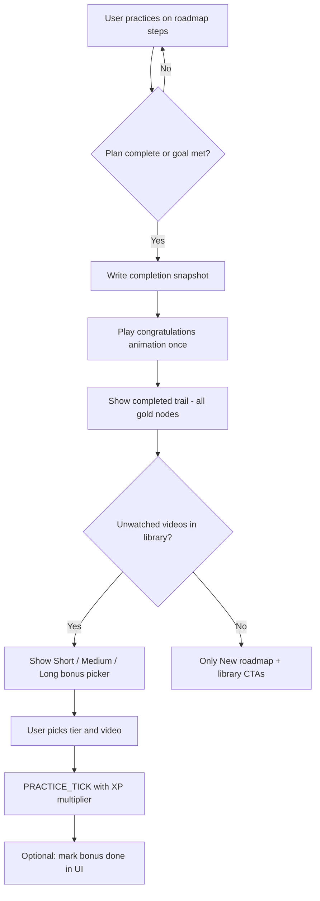

# Roadmap completion trail, celebration, and bonus-video incentives

**Status:** R1–R3 implemented; R4 planned  
**Last updated:** 2026-06-04  
**Related:** [`DAILY-PATH-DESIGN.md`](DAILY-PATH-DESIGN.md), [`watchPanelGoalRingCelebration.ts`](../src/content/watchPanelGoalRingCelebration.ts), [`todayPath.ts`](../src/lib/todayPath.ts)

---

## Table of contents

1. [Problem statement](#1-problem-statement)
2. [Product goals](#2-product-goals)
3. [Part A — Keep the completed roadmap visible](#3-part-a--keep-the-completed-roadmap-visible)
4. [Part B — Congratulations animation](#4-part-b--congratulations-animation)
5. [Part C — Bonus video tiers (short / medium / long)](#5-part-c--bonus-video-tiers-short--medium--long)
6. [How the three parts fit together](#6-how-the-three-parts-fit-together)
7. [Phased rollout](#7-phased-rollout)
8. [Open questions](#8-open-questions)

---

## 1. Problem statement

### What happens today

| Moment | Current behavior | User feeling |
|--------|------------------|--------------|
| User finishes every step on the roadmap | Steps may disappear because `videoHasWatchTime()` excludes watched videos from candidates; cached plan invalidates | Trail vanishes |
| Daily goal met (roadmap done) | `showGoalMet && nodes.length === 0` → celebrate header + **empty body** (`dashboardPathSection.ts`) | “I did all that work and the page is blank” |
| User wants to keep going | “New path” rebuilds with only **unwatched** videos | No trophy wall of what they just finished |

The roadmap should feel like a **finished level** you can look back on — not a checklist that deletes itself.

---

## 2. Product goals

1. **Completion memory** — After the roadmap is done (all steps complete and/or daily goal met for this plan), the **same trail layout** stays on screen: gold nodes, connectors, titles, thumbnails.
2. **Emotional payoff** — One clear **congratulations moment** (animation + copy) when completion is detected, without blocking the trail.
3. **Optional stretch goal** — Offer **one curated “bonus” watch** with higher XP, chosen from three length tiers so the user picks risk/reward.

Non-goals for this plan:

- Changing how practice time counts toward the daily goal ring (still `PRACTICE_TICK` → `dailySeconds`).
- Requiring bonus video to “count” as roadmap steps.
- Full Duolingo chest / league systems.

---

## 3. Part A — Keep the completed roadmap visible

### 3.1 Definition of “roadmap complete”

Use one primary completion signal (document in impl):

| Signal | When |
|--------|------|
| **Plan complete** | Every step in the active `todayPathPlan` has `practicedSecOnStep >= allocatedSec` (or daily slack) |
| **Goal met** | `todayPracticeSec >= dailyTargetSec − slack` (existing `PATH_GOAL_MET_SLACK_SEC`) |

**Recommended UX rule:** Show the **completion trail** when **plan complete OR goal met while this plan was active**. If only goal met via off-plan videos, still snapshot whatever plan existed.

### 3.2 Snapshot model (persisted)

Introduce a **completion snapshot** separate from the live plan builder:

```ts
// Conceptual — names TBD in storageTypes
roadmapCompletionSnapshot?: {
  dateKey: string;           // local day plan belonged to
  completedAtMs: number;
  dailyGoalSec: number;
  todayPracticeSecAtComplete: number;
  steps: {
    videoId: string;
    durationSec: number;
    allocatedSec: number;
    practicedSecOnStep: number;  // frozen at complete
    title: string;             // denormalized for display if library changes
    thumbnailVideoId: string;
  }[];
} | null;
```

**When to write snapshot**

- First moment plan becomes complete (or goal met with non-empty plan): copy current plan + node VM fields → `roadmapCompletionSnapshot`, set `roadmapCompletionSeenAtMs` optional for animation gating.
- Do **not** clear snapshot when user opens “New path” until they confirm (or auto-archive previous day).

**When to read snapshot**

- If `snapshot.dateKey === todayKey` and user is not force-rebuilding: render **completion mode** from snapshot, not `resolveTodayPathUi` empty goal-met body.
- Live `todayPathPlan` can be cleared for packing logic, but UI prefers snapshot for display.

### 3.3 UI modes (roadmap tab)

```
┌─────────────────────────────────────────┐
│  ACTIVE        │  COMPLETED (new)      │
├────────────────┼───────────────────────┤
│ Build/pack     │ Read snapshot only    │
│ unwatched only │ All steps stepCompleted│
│ active step    │ No START callout      │
│ START on first │ Header: goal met +    │
│ incomplete     │ “You finished…”       │
└────────────────┴───────────────────────┘
```

**Visual (completed mode)**

- All nodes: `path-node--stepCompleted`, check badge, full progress ring (100%).
- Trail connectors: solid / gold tint (reuse existing completed styles).
- Header: keep minutes summary for the day; replace “X min left” with completion line.
- Footer actions (completed mode only):
  - **Primary:** Bonus tier picker (Part C) — no regenerate / new path until the next calendar day.

**Edge cases**

| Case | Behavior |
|------|----------|
| User completes plan but not daily goal | Still show trail; header says “Roadmap complete — N min left on daily goal” OR treat plan-only complete as full celebrate (product choice in §8). |
| User met goal before finishing last step | Snapshot on goal met with partial plan, or wait for plan complete (recommend: snapshot on **plan complete**, goal met banner additive). |
| Next calendar day | Snapshot from prior day hidden; fresh active roadmap (existing `dateKey` rules). |
| Video removed from library | Snapshot still shows title from denormalized fields; link may 404 — show disabled state. |

### 3.4 Interaction with “unwatched only” packing

- **Active roadmap:** unchanged — only videos with `!videoHasWatchTime()`.
- **Completed roadmap:** snapshot **ignores** unwatched filter; watched videos remain on trail.
- **New roadmap** after complete: not offered same day; next calendar day starts a fresh active roadmap (`dateKey` rollover).

### 3.5 Implementation sketch (for later)

| Layer | Change |
|-------|--------|
| `storageTypes` + migrate | `roadmapCompletionSnapshot`, optional `bonusVideoOffer` state |
| `todayPath.ts` | `resolveTodayPathUi` returns `mode: 'active' \| 'completed'` + nodes from snapshot |
| `dashboardPathSection.ts` | Branch body: never `path-empty--celebrate` when snapshot has steps |
| `main.ts` | On dashboard refresh / storage poll, detect transition → trigger celebration once |

### 3.6 Success criteria

- User who finishes last step never sees an empty trail on the same day.
- Completed trail matches pre-complete order and thumbnails.
- “New roadmap” still works without corrupting snapshot until acknowledged.

---

## 4. Part B — Congratulations animation

### 4.1 Design intent

- **When:** Once per completion event per `dateKey` (not every dashboard tab focus).
- **Where:** Roadmap section (hero overlay on trail), optionally subtle echo on watch panel ring if daily goal met at same time.
- **Tone:** Short, satisfying, not blocking — user can scroll/click within ~2s; “Skip” on repeat views.

### 4.2 Reuse vs new

| Asset | Reuse? |
|-------|--------|
| Goal ring celebration (`watchPanelGoalRingCelebration.ts`, anime.js + d3) | **Pattern reuse** — particle burst, timeline, generation guard |
| Roadmap node DOM | **New** — animate trail top-to-bottom or center-out |

**Recommendation:** New module `roadmapCompletionCelebration.ts` (dashboard-only) sharing utilities (colors, `bumpGeneration`, stale guard) with ring celebration.

### 4.3 Storyboard (choreography)

**Phase 0 — Trigger (0 ms)**  
Detect `!wasComplete && isComplete` in view model or dashboard listener.

**Phase 1 — Backdrop (0–200 ms)**  
Soft vignette over trail; header text hidden briefly.

**Phase 2 — Headline (200–600 ms)**  
- Large: “Roadmap complete!” (i18n `path.completeTitle`)
- Sub: daily goal line if met (`path.completeSubGoalMet`)

**Phase 3 — Trail pulse (400–1200 ms)**  
- For each node in order (stagger 80 ms):
  - Scale 1 → 1.08 → 1
  - Progress ring stroke dash animates to 100%
  - Check icon pop (spring)
- Connector lines draw-on (SVG stroke-dashoffset) — optional v2

**Phase 4 — Confetti / sparks (600–1800 ms)**  
- Burst from active node position (or last node), 12–20 particles
- Palette aligned with ring celebration: `#7dffa8`, `#ffdd57`, `#ff9b4a`

**Phase 5 — Settle (1800–2500 ms)**  
- Fade overlay; reveal bonus-offer card (Part C) if applicable
- Persist `roadmapCelebrationShownAtMs` so refresh does not replay

**Reduced motion:** `prefers-reduced-motion: reduce` → static banner + checkmarks only, no particles.

### 4.4 Technical notes

| Topic | Plan |
|-------|------|
| Library | anime.js (already in extension for ring); d3 optional for particle layout |
| DOM | Overlay `div.path-celebration-layer` inside `.path-section`, `pointer-events: none` during anim, then `auto` for CTA |
| Tests | Unit-test timeline callbacks / reduced-motion branch; no pixel tests |
| Performance | One timeline per completion; cancel on unmount / view change |

### 4.5 Copy (i18n keys to add later)

- `path.completeTitle`
- `path.completeSubGoalMet`
- `path.completeSubPlanOnly`
- `path.celebrationSkip`

---

## 5. Part C — Bonus video tiers (short / medium / long)

### 5.1 Intent

After the roadmap is done, nudge the user to **one more intentional watch** with **higher XP** based on commitment (video length). This is separate from roadmap steps — it’s an opt-in challenge.

### 5.2 Three tiers

| Tier | Label (i18n) | XP multiplier on practice | Suggested duration band (starting point) |
|------|----------------|---------------------------|----------------------------------------|
| **Short** | `path.bonus.short` | **×1.5** | `< 10 min` |
| **Medium** | `path.bonus.medium` | **×2.0** | `10 min – 25 min` |
| **Long** | `path.bonus.long` | **×3.0** | `> 25 min` |

Bands use `LibraryItem.durationSec` from library (same source as roadmap packing). Thresholds are **settings-tunable** later; ship with constants in `roadmapBonusVideo.ts`.

**Display example**

```
┌──────────────────────────────────────────────┐
│  Want more XP? Pick a bonus video            │
│  ┌─────────┐ ┌─────────┐ ┌─────────┐        │
│  │ Short   │ │ Medium  │ │ Long    │        │
│  │ ×1.5 XP │ │ ×2 XP   │ │ ×3 XP   │        │
│  │ ~6 min  │ │ ~18 min │ │ ~42 min │        │
│  └─────────┘ └─────────┘ └─────────┘        │
│  [thumbnail row per tier — one pick]         │
└──────────────────────────────────────────────┘
```

### 5.3 Eligibility pool

Candidate videos for each tier:

- In-progress library (`completedAt === null`)
- Has `durationSec > 0`
- **`!videoHasWatchTime()`** (still unwatched) — OR include lightly-started videos (product choice; default unwatched only)
- Not already in today’s completion snapshot (optional: allow snapshot videos if unwatched rule fails — unlikely)

**Picker per tier:** One recommendation each:

1. Filter by duration band.
2. Sort: oldest `addedAt` first (consistent with roadmap) or random among top 3 for variety (A/B later).
3. If tier empty, show “No short videos saved” disabled card.

### 5.4 Selection and session rules

Persist for the day:

```ts
roadmapBonusPick?: {
  dateKey: string;
  videoId: string;
  tier: 'short' | 'medium' | 'long';
  multiplier: 1.5 | 2 | 3;
  pickedAtMs: number;
} | null;
```

| Rule | Detail |
|------|--------|
| One pick per day | New pick replaces previous only before first `PRACTICE_TICK` on that video |
| Multiplier applies | Only to `PRACTICE_TICK` for `videoId === pick.videoId` while `dateKey` matches |
| Stacking | See §5.5 |
| UI after pick | Highlight chosen card; “Open on YouTube”; show active multiplier chip on watch panel (future) |

### 5.5 XP stacking (recommended)

Current pipeline (`playerProgress.ts`):

`base XP/min × weekendMultiplier × prestigeMultiplier`

**Proposed:**

`base × weekend × prestige × roadmapBonusMultiplier` where bonus is `1 | 1.5 | 2 | 3` (1 = no bonus).

| Scenario | Example |
|----------|---------|
| Weekday, no prestige, long bonus | 3× on practice minutes |
| Saturday, prestige 2, medium bonus | `2 × 1.2 × 2 = 4.8×` (floor per tick) |

Document in UI: “Stacks with weekend bonus” if true.

**Alternative (simpler messaging):** Bonus replaces weekend — **not recommended** (feels bad on Saturday).

### 5.6 Where it surfaces

1. **Completed roadmap** — card row under trail (primary).
2. **Watch panel** — small badge when watching the picked video: “×2 Roadmap bonus”.
3. **XP toast / log** — include `roadmapBonus` in `jpXpLogBackground` reason field.

### 5.7 Anti-abuse / clarity

- Multiplier applies to **practice XP from minutes**, not one-shot quest reward.
- Cap optional: max +N XP per day from bonus tier (v2 if farming).
- Changing library duration after pick: freeze multiplier at pick time; revalidate band on pick only.

### 5.8 Implementation sketch (for later)

| Piece | Work |
|-------|------|
| `roadmapBonusVideo.ts` | Tier bands, pick recommendations, multiplier getter |
| `backgroundMessageHandlers` `PRACTICE_TICK` | Multiply XP when pick active |
| `dashboardPathSection.ts` | Three-card picker UI |
| `storageTypes` v14 | `roadmapBonusPick`, `roadmapCompletionSnapshot` |
| i18n | Tier labels, empty tier, active bonus chip |

---

## 6. How the three parts fit together



**Session narrative:** Finish roadmap → see your win trail → celebration → choose a harder video for extra XP → keep practicing or start tomorrow’s roadmap.

---

## 7. Phased rollout

| Phase | Scope | Outcome |
|-------|--------|---------|
| **R1** | Completion snapshot + completed trail UI (Part A only) | No more empty page |
| **R2** | Congratulations animation (Part B), reduced-motion safe | Emotional payoff |
| **R3** | Bonus tier picker + XP multiplier (Part C) | Stretch goal + retention |
| **R4** | Polish: connector draw-on, watch panel chip, settings for tier thresholds | Tune and localize |

Each phase shippable behind nothing (feature is additive). R1 does not require R3.

---

## 8. Open questions

1. **Plan complete vs goal met:** Is snapshot on plan complete enough, or must daily goal be met to freeze trail?
2. **Partial plan when goal met early:** Snapshot incomplete trail or hide until all steps done?
3. **Bonus pool:** Strictly unwatched only, or allow videos with &lt; 1 min today?
4. **One bonus per day vs unlimited picks:** Confirm one pick.
5. **After bonus video gets watch time:** Does it appear on *next* day’s roadmap? (Yes, excluded by unwatched rule — expected.)
6. **Rename `todayPathPlan` → `roadmapPlan`:** Cosmetic refactor — do with R1 or defer?
7. **Translate “Roadmap”** in non-English locales (currently English “Roadmap” in several files).

---

## Appendix — Current code touchpoints

| File | Relevance |
|------|-----------|
| [`todayPath.ts`](../src/lib/todayPath.ts) | Node states, `showGoalMet`, unwatched filter |
| [`dashboardPathSection.ts`](../src/dashboard/dashboardPathSection.ts) | Empty celebrate body when `nodes.length === 0` |
| [`videoDailyPractice.ts`](../src/lib/videoDailyPractice.ts) | `videoHasWatchTime` |
| [`playerProgress.ts`](../src/lib/playerProgress.ts) | XP multipliers |
| [`watchPanelGoalRingCelebration.ts`](../src/content/watchPanelGoalRingCelebration.ts) | Animation patterns |

---

*End of plan — implementation tickets should link here and update §8 decisions as they are locked.*
