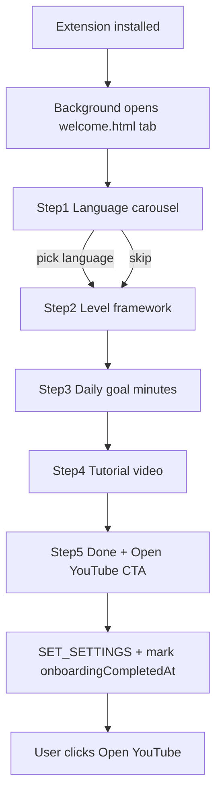

# Welcome onboarding page — design plan

**Status:** Implemented  
**Audience:** Anyone building first-run onboarding for JustPractice  
**User decisions locked in:** include **level framework** step; finish with **“Open YouTube” button** (no auto-open).

---

## 1. What you want (plain language)

When someone **installs** the extension, Chrome opens a dedicated **welcome tab** (extension page, not YouTube). It walks them through setup before they start practicing:

| Step | Purpose |
|------|---------|
| 1. **Language** | iPhone-style carousel: “Hello / welcome / select language” cycles through all 6 UI languages with a smooth transition; user taps their language to lock it in |
| 2. **Level framework** | Choose JLPT, CEFR, or Custom (same semantics as dashboard Settings) |
| 3. **Daily goal** | Set daily practice target in **minutes** (same as dashboard Goals) |
| 4. **How it works** | Embedded or linked **YouTube tutorial** (URL TBD — you will provide) |
| 5. **Finish** | Primary CTA: **Open YouTube**; secondary: open dashboard / skip if needed |

After completion, do **not** show the welcome tab again on normal use. Replace the small popup tip (`jpPopupTipSeen`) with this flow.

---

## 2. What you might be missing (recommendations)

### Strongly recommended (include in v1)

- **First install only** — `chrome.runtime.onInstalled` with `details.reason === 'install'`. Updates must **not** reopen welcome.
- **Completion flag** — `onboardingCompletedAt` in `PersistedData`.
- **Skip / finish later** — subtle “Skip for now” on early steps; minimal defaults (browser language via `auto`, JLPT, no daily goal).
- **Privacy one-liner** — “All data stays on this device”.
- **Pin extension hint** — puzzle icon pin guidance.
- **Library-first messaging** — practice time counts only for **saved library videos**.
- **RTL + reduced motion** — Hebrew carousel slide uses `dir="rtl"`; respect `prefers-reduced-motion`.
- **Replay entry** — dashboard Settings: “Show welcome guide again”.

### Optional (v2)

- Display name, goal notifications, custom levels editor on welcome, auto-open YouTube.

---

## 3. User flow

---

## 4. Technical approach

- **Open tab:** `src/background/backgroundOnboarding.ts` on `install` only.
- **Page:** `src/welcome/index.html`, `main.ts`, `welcome.css`.
- **Config:** `src/lib/welcomeConfig.ts` — tutorial video ID (empty until provided).
- **Persist:** `MSG.SET_SETTINGS` + `onboardingCompletedAt` on `PersistedData`.
- **i18n:** `welcome.*` keys in all 6 locale files.

---

## 5. Success criteria

- Fresh install opens exactly **one** welcome tab.
- Settings in dashboard match choices (language, framework, daily goal).
- “Open YouTube” works; no automatic tab open.
- Welcome does not reappear after completion unless user chooses “Show welcome again”.
